Events notify you when important things happen during agent execution.

```mermaid
graph LR
    subgraph "Event Flow"
        A[🤖 Agent] --> E[📡 Events]
        E --> S[Start]
        E --> T[Tool Call]
        E --> M[Message]
        E --> D[Done]
    end
    
    classDef agent fill:#6366F1,stroke:#7C90A0,color:#fff
    classDef event fill:#F59E0B,stroke:#7C90A0,color:#fff
    
    class A agent
    class E,S,T,M,D event
```



## Quick Start

<Steps>
<Step title="Listen to Events">
```rust
use praisonai::Agent;

let agent = Agent::new()
    .name("Assistant")
    .on_event(|event| {
        println!("Event: {:?}", event);
    })
    .build()?;
```
</Step>
</Steps>

---

## Event Types

| Event | When |
|-------|------|
| `Start` | Agent begins processing |
| `ToolCall` | Tool is about to execute |
| `ToolResult` | Tool finished executing |
| `Message` | Agent produces output |
| `Error` | Error occurred |
| `End` | Agent finished |

---

## Common Patterns

### Progress Tracking

```rust
let agent = Agent::new()
    .on_event(|event| {
        match event {
            Event::Start => show_spinner(),
            Event::ToolCall(name) => update_status(&name),
            Event::End => hide_spinner(),
            _ => {}
        }
    })
    .build()?;
```

---

## Related

<CardGroup cols={2}>
  <Card title="Callbacks" icon="phone" href="/docs/rust/callbacks">
    Callback handlers
  </Card>
  <Card title="Streaming" icon="stream" href="/docs/rust/streaming">
    Stream events
  </Card>
</CardGroup>
