Configure execution limits to prevent runaway agents and control costs.

```mermaid
graph LR
    subgraph "Execution Control"
        A[🤖 Agent] --> L[⏱️ Limits]
        L --> I[🔄 Max Iterations]
        L --> T[⏰ Timeout]
    end
    
    classDef agent fill:#6366F1,stroke:#7C90A0,color:#fff
    classDef limit fill:#F59E0B,stroke:#7C90A0,color:#fff
    
    class A agent
    class L,I,T limit
```



## Quick Start

<Steps>
<Step title="Default Execution">
```rust
use praisonai::Agent;

// Uses safe defaults: 10 iterations, 300s timeout
let agent = Agent::new()
    .name("Assistant")
    .build()?;
```
</Step>

<Step title="Custom Limits">
```rust
use praisonai::{Agent, ExecutionConfig};

let config = ExecutionConfig::new()
    .max_iterations(5)
    .timeout(60);  // 60 seconds

let agent = Agent::new()
    .name("Assistant")
    .execution(config)
    .build()?;
```
</Step>
</Steps>

---

## Configuration

| Option | Type | Default | Description |
|--------|------|---------|-------------|
| `max_iterations` | `usize` | `10` | Maximum tool call loops |
| `timeout_secs` | `u64` | `300` | Timeout in seconds |
| `stream` | `bool` | `true` | Enable streaming output |

---

## Best Practices

<AccordionGroup>
  <Accordion title="Set reasonable iteration limits">
    5-10 iterations handles most tasks. Higher values risk infinite loops.
  </Accordion>
  
  <Accordion title="Use timeouts for safety">
    Always set timeouts to prevent stuck agents from running indefinitely.
  </Accordion>
</AccordionGroup>

---

## Related

<CardGroup cols={2}>
  <Card title="Agent" icon="robot" href="/docs/rust/agent">
    Agent configuration
  </Card>
  <Card title="Autonomy" icon="robot" href="/docs/rust/autonomy">
    Autonomy levels
  </Card>
</CardGroup>
