Failover automatically switches to backup providers when the primary fails.

```mermaid
graph LR
    subgraph "Failover"
        A[🤖 Agent] --> P1[🟢 Primary]
        P1 --> |Fails| P2[🟡 Backup]
        P2 --> |Fails| P3[🔴 Fallback]
    end
    
    classDef agent fill:#6366F1,stroke:#7C90A0,color:#fff
    classDef primary fill:#10B981,stroke:#7C90A0,color:#fff
    classDef backup fill:#F59E0B,stroke:#7C90A0,color:#fff
    classDef fallback fill:#EF4444,stroke:#7C90A0,color:#fff
    
    class A agent
    class P1 primary
    class P2 backup
    class P3 fallback
```



## Quick Start

<Steps>
<Step title="Create Failover-Ready Agent">
```rust
use praisonai::Agent;

// Primary agent with fast model
let primary = Agent::new()
    .name("Primary Assistant")
    .model("gpt-4o")
    .build()?;

// Backup agent with different provider
let backup = Agent::new()
    .name("Backup Assistant")
    .model("claude-3-sonnet")
    .build()?;

// Implement failover at application level
async fn chat_with_failover(query: &str) -> Result<String> {
    match primary.chat(query).await {
        Ok(response) => Ok(response),
        Err(_) => backup.chat(query).await,
    }
}
```
</Step>

<Step title="Local Fallback">
```rust
use praisonai::Agent;

// Cloud-first, local fallback
let cloud = Agent::new()
    .name("Cloud Assistant")
    .model("gpt-4o")
    .build()?;

let local = Agent::new()
    .name("Local Assistant")
    .model("ollama/llama3")
    .base_url("http://localhost:11434")
    .build()?;

// Try cloud, fall back to local if unavailable
```
</Step>
</Steps>

---

## When Failover Triggers

| Trigger | Action |
|---------|--------|
| API timeout | Try next provider |
| Rate limit | Try next provider |
| Service down | Try next provider |
| All fail | Return error |

---

## Best Practices

<AccordionGroup>
  <Accordion title="Order by preference">
    Put best provider first, cheapest backup last.
  </Accordion>
  
  <Accordion title="Include local fallback">
    Add Ollama as last resort for offline resilience.
  </Accordion>
</AccordionGroup>

---

## Related

<CardGroup cols={2}>
  <Card title="LLM" icon="microchip" href="/docs/rust/llm">
    LLM providers
  </Card>
  <Card title="Gateway" icon="network-wired" href="/docs/rust/gateway">
    Unified API
  </Card>
</CardGroup>
