Files provides utilities for file operations in agent workflows.

```mermaid
graph LR
    subgraph "File Operations"
        F[📁 Files] --> R[📖 Read]
        F --> W[✏️ Write]
        F --> S[🔍 Search]
    end
    
    classDef files fill:#6366F1,stroke:#7C90A0,color:#fff
    classDef ops fill:#10B981,stroke:#7C90A0,color:#fff
    
    class F files
    class R,W,S ops
```



## Quick Start

<Steps>
<Step title="File Session Store">
```rust
use praisonai::session::FileSessionStore;

let store = FileSessionStore::new("/path/to/sessions");
store.save("session-1", &data).await?;
```
</Step>

<Step title="File Search">
```rust
use praisonai::parity::FileSearchCall;

let search = FileSearchCall {
    query: "keyword".to_string(),
    path: Some("/docs".to_string()),
    ..Default::default()
};
```
</Step>
</Steps>

---

## FileSessionStore

```rust
pub struct FileSessionStore {
    path: PathBuf,
}
```

Persists session data to the filesystem.

---

## FileMatch

```rust
pub struct FileMatch {
    pub path: String,
    pub content: String,
    pub line: usize,
}
```

Represents a file search result match.

---

## Best Practices

<AccordionGroup>
  <Accordion title="Use absolute paths">
    Prefer absolute paths for consistency.
  </Accordion>
  
  <Accordion title="Handle errors gracefully">
    Always handle file I/O errors appropriately.
  </Accordion>
</AccordionGroup>

---

## Related

<CardGroup cols={2}>
  <Card title="Sessions" icon="user" href="/docs/rust/sessions">
    Session management
  </Card>
  <Card title="Documents" icon="file" href="/docs/rust/documents">
    Document handling
  </Card>
</CardGroup>
