File handling enables agents to persist sessions and search file stores.

```mermaid
graph LR
    subgraph "File Operations"
        A[🤖 Agent] --> S[💾 Session Store]
        S --> F[📁 File System]
        A --> R[🔍 File Search]
    end
    
    classDef agent fill:#6366F1,stroke:#7C90A0,color:#fff
    classDef store fill:#F59E0B,stroke:#7C90A0,color:#fff
    classDef file fill:#10B981,stroke:#7C90A0,color:#fff
    
    class A agent
    class S store
    class F,R file
```



## Quick Start

<Steps>
<Step title="Persist Agent Sessions">
```rust
use praisonai::{Agent, FileSessionStore};

// Create session store (uses default ~/.praisonai/sessions/)
let store = FileSessionStore::new();

// Create agent with session persistence
let agent = Agent::new()
    .name("Assistant")
    .instructions("You are a helpful assistant")
    .session_store(store)
    .build()?;

// Sessions automatically persist across restarts
agent.start("Remember my name is Alice").await?;
```
</Step>

<Step title="Custom Session Directory">
```rust
use praisonai::FileSessionStore;

// Use custom directory for sessions
let store = FileSessionStore::with_dir("/path/to/sessions")
    .max_messages(100);  // Limit stored messages
```
</Step>
</Steps>

---

## User Interaction Flow


---

## FileSessionStore

Persists session data to JSON files on disk.

```rust
pub struct FileSessionStore {
    session_dir: PathBuf,
    max_messages: usize,
}
```

### Configuration Options

| Option | Type | Default | Description |
|--------|------|---------|-------------|
| `session_dir` | `PathBuf` | `~/.praisonai/sessions/` | Directory for session files |
| `max_messages` | `usize` | `100` | Maximum messages per session |

### Methods

| Method | Signature | Description |
|--------|-----------|-------------|
| `new()` | `fn new() -> Self` | Create with default directory |
| `with_dir(dir)` | `fn with_dir(impl Into<PathBuf>) -> Self` | Create with custom directory |
| `max_messages(n)` | `fn max_messages(self, usize) -> Self` | Set message limit |

### Example

```rust
use praisonai::FileSessionStore;

// Default location
let store = FileSessionStore::new();

// Custom location with message limit
let store = FileSessionStore::with_dir("./my_sessions")
    .max_messages(50);
```

---

## FileSearchCall

Search across file stores (used with Gemini deep research).

```rust
pub struct FileSearchCall {
    pub store_names: Vec<String>,
}
```

### Configuration Options

| Option | Type | Default | Description |
|--------|------|---------|-------------|
| `store_names` | `Vec<String>` | `[]` | Names of stores to search |

### Example

```rust
use praisonai::parity::FileSearchCall;

// Search specific stores
let search = FileSearchCall::new(vec![
    "documents".to_string(),
    "knowledge_base".to_string(),
]);

println!("Searching {} stores", search.store_names.len());
```

---

## Best Practices

<AccordionGroup>
  <Accordion title="Use default paths for simplicity">
    `FileSessionStore::new()` uses `~/.praisonai/sessions/` which works across platforms.
  </Accordion>
  
  <Accordion title="Set message limits for long-running agents">
    Use `.max_messages(n)` to prevent unbounded memory growth in persistent agents.
  </Accordion>
  
  <Accordion title="Handle file I/O errors gracefully">
    Session store operations return `Result` types - always handle potential errors.
  </Accordion>
</AccordionGroup>

---

## Related

<CardGroup cols={2}>
  <Card title="Sessions" icon="user" href="/docs/rust/sessions">
    Session management API
  </Card>
  <Card title="Memory" icon="brain" href="/docs/rust/memory">
    In-memory storage options
  </Card>
</CardGroup>
