Flow enables sequential agent execution with conditional routing.

```mermaid
graph LR
    subgraph "Agent Flow"
        A1[🤖 Agent 1] --> A2[🤖 Agent 2]
        A2 --> A3[🤖 Agent 3]
    end
    
    classDef agent fill:#6366F1,stroke:#7C90A0,color:#fff
    
    class A1,A2,A3 agent
```



## Quick Start

<Steps>
<Step title="Create Flow">
```rust
use praisonai::workflows::AgentFlow;
use praisonai::agent::Agent;

let flow = AgentFlow::new()
    .agent(analyst)
    .agent(writer)
    .agent(reviewer);
```
</Step>

<Step title="Run Flow">
```rust
let result = flow.run("Analyze this data").await?;
println!("{}", result);
```
</Step>
</Steps>

---

## AgentFlow

```rust
pub struct AgentFlow {
    pub steps: Vec<FlowStep>,
}
```

| Method | Description |
|--------|-------------|
| `new()` | Create new flow |
| `agent(a)` | Add agent step |
| `step(s)` | Add any flow step |
| `run(input)` | Execute the flow |

---

## FlowStep Types

| Type | Description |
|------|-------------|
| `Agent` | Execute single agent |
| `Route` | Conditional branching |
| `Parallel` | Concurrent execution |
| `Loop` | Iterate over items |
| `Repeat` | Repeat N times |

---

## Best Practices

<AccordionGroup>
  <Accordion title="Order agents logically">
    Place agents in the order of their dependencies.
  </Accordion>
  
  <Accordion title="Use routing for conditionals">
    Use Route step for conditional logic.
  </Accordion>
</AccordionGroup>

---

## Related

<CardGroup cols={2}>
  <Card title="Workflows" icon="sitemap" href="/docs/rust/workflows">
    Workflow patterns
  </Card>
  <Card title="Routing" icon="route" href="/docs/rust/routing">
    Conditional routing
  </Card>
</CardGroup>
