Workflows chain agents, conditions, and loops into powerful automation pipelines.

```mermaid
graph LR
    subgraph "Workflow"
        S[📥 Input] --> A1[🤖 Agent 1]
        A1 --> C{Check}
        C --> |Pass| A2[🤖 Agent 2]
        C --> |Fail| A1
        A2 --> O[📤 Output]
    end
    
    classDef io fill:#6366F1,stroke:#7C90A0,color:#fff
    classDef agent fill:#F59E0B,stroke:#7C90A0,color:#fff
    classDef output fill:#10B981,stroke:#7C90A0,color:#fff
    
    class S,O io
    class A1,A2,C agent
```



## Quick Start

<Steps>
<Step title="Linear Workflow">
```rust
use praisonai::{Agent, workflow};

let writer = Agent::new().name("Writer").build()?;
let editor = Agent::new().name("Editor").build()?;

let flow = workflow()
    .then(writer)
    .then(editor);

flow.run("Write about AI").await?;
```
</Step>

<Step title="With Conditions">
```rust
use praisonai::{workflow, when};

let flow = workflow()
    .then(researcher)
    .when(|result| result.len() > 100)
        .then(summarizer)
    .then(publisher);
```
</Step>
</Steps>

---

## Workflow Patterns

### Research → Write → Edit

```rust
use praisonai::workflow;

let content_pipeline = workflow()
    .then(researcher)    // Research the topic
    .then(writer)        // Write the content
    .then(editor)        // Edit and polish
    .then(reviewer);     // Final review
```

### With Validation Loop

```rust
use praisonai::{workflow, r#loop};

let validated_pipeline = workflow()
    .then(generator)
    .then(r#loop(validator)
        .until(|r| r.contains("approved"))
        .max_iterations(3));
```

---

## Best Practices

<AccordionGroup>
  <Accordion title="Start simple">
    Build linear workflows first, add branching later.
  </Accordion>
  
  <Accordion title="Give each step a clear purpose">
    Name agents by their role in the workflow.
  </Accordion>
</AccordionGroup>

---

## Related

<CardGroup cols={2}>
  <Card title="Conditions" icon="code-branch" href="/docs/rust/conditions">
    Add branching
  </Card>
  <Card title="Loops" icon="rotate" href="/docs/rust/loops">
    Add iteration
  </Card>
  <Card title="Agent Teams" icon="users" href="/docs/rust/agent-team">
    Team processes
  </Card>
  <Card title="Parallel" icon="bolt" href="/docs/rust/parallel-execution">
    Run in parallel
  </Card>
</CardGroup>
