Gateway provides a unified API across OpenAI, Anthropic, and other LLM providers.

```mermaid
graph LR
    subgraph "Gateway"
        A[🤖 Agent] --> G[🚪 Gateway]
        G --> O[OpenAI]
        G --> AN[Anthropic]
        G --> OL[Ollama]
    end
    
    classDef agent fill:#6366F1,stroke:#7C90A0,color:#fff
    classDef gateway fill:#F59E0B,stroke:#7C90A0,color:#fff
    classDef provider fill:#10B981,stroke:#7C90A0,color:#fff
    
    class A agent
    class G gateway
    class O,AN,OL provider
```



## Quick Start

<Steps>
<Step title="Switch Providers">
```rust
use praisonai::Agent;

// Same code works with any provider
let agent = Agent::new()
    .name("Assistant")
    .model("gpt-4o")  // OpenAI
    .build()?;

let agent = Agent::new()
    .name("Assistant")
    .model("claude-3-opus")  // Anthropic
    .build()?;

let agent = Agent::new()
    .name("Assistant")
    .model("ollama/llama3")  // Local
    .build()?;
```
</Step>
</Steps>

---

## Supported Providers

| Provider | Prefix | Example |
|----------|--------|---------|
| OpenAI | (none) | `gpt-4o` |
| Anthropic | (none) | `claude-3-opus` |
| Ollama | `ollama/` | `ollama/llama3` |
| Azure | `azure/` | `azure/gpt-4` |

---

## Related

<CardGroup cols={2}>
  <Card title="LLM" icon="microchip" href="/docs/rust/llm">
    LLM configuration
  </Card>
  <Card title="Failover" icon="rotate" href="/docs/rust/failover">
    Provider fallback
  </Card>
</CardGroup>
