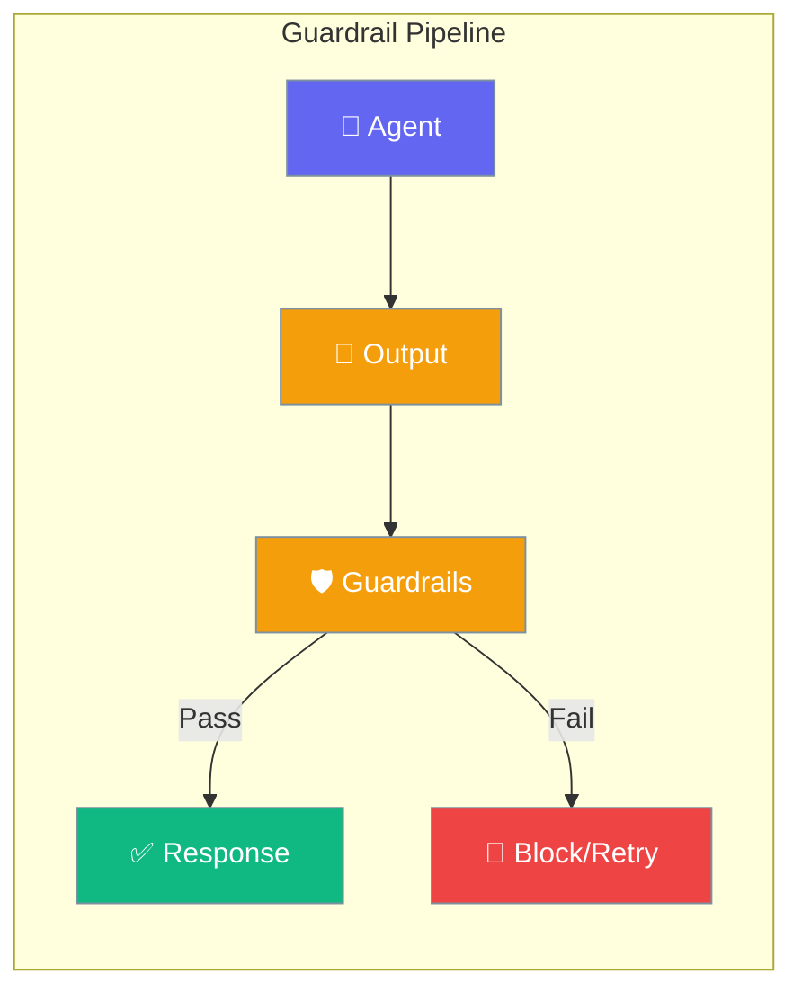
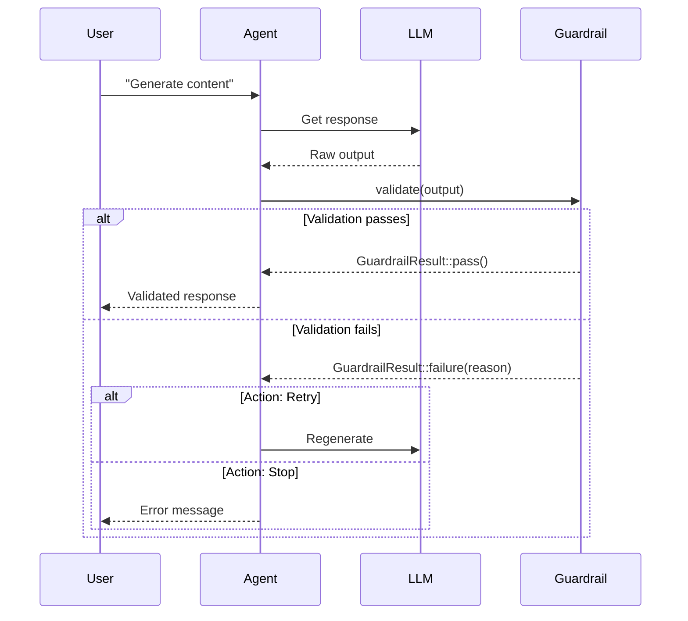

Guardrails validate and filter agent outputs to ensure safety, quality, and compliance.



## Quick Start

<Steps>
<Step title="Create a Guardrail">
```rust
use praisonai::{Guardrail, GuardrailResult};

struct ContentFilter;

impl Guardrail for ContentFilter {
    fn name(&self) -> &str { "content_filter" }
    fn description(&self) -> &str { "Filters inappropriate content" }
    
    fn validate(&self, content: &str) -> GuardrailResult {
        if content.contains("inappropriate") {
            GuardrailResult::failure("Content contains inappropriate material")
        } else {
            GuardrailResult::pass()
        }
    }
}
```
</Step>

<Step title="Async Guardrail">
```rust
use praisonai::{AsyncGuardrail, GuardrailResult, async_trait};

struct LlmFilter;

#[async_trait]
impl AsyncGuardrail for LlmFilter {
    fn name(&self) -> &str { "llm_filter" }
    fn description(&self) -> &str { "LLM-based content moderation" }
    
    async fn validate(&self, content: &str) -> GuardrailResult {
        // Call moderation API
        GuardrailResult::pass()
    }
}
```
</Step>
</Steps>

---

## User Interaction Flow



---

## GuardrailResult

Result of guardrail validation.

```rust
pub struct GuardrailResult {
    pub success: bool,
    pub result: Option<String>,
    pub error: Option<String>,
    pub metadata: HashMap<String, String>,
}
```

### Factory Methods

| Method | Signature | Description |
|--------|-----------|-------------|
| `success(result)` | `fn success(impl Into<String>) -> Self` | Pass with modified content |
| `pass()` | `fn pass() -> Self` | Pass without modification |
| `failure(error)` | `fn failure(impl Into<String>) -> Self` | Fail with error message |
| `from_tuple(success, data)` | `fn from_tuple(bool, impl Into<String>) -> Self` | Create from tuple |

### Instance Methods

| Method | Signature | Description |
|--------|-----------|-------------|
| `with_metadata(key, value)` | `fn with_metadata(self, impl Into<String>, impl Into<String>) -> Self` | Add metadata |
| `is_success()` | `fn is_success(&self) -> bool` | Check if passed |
| `is_failure()` | `fn is_failure(&self) -> bool` | Check if failed |
| `get_result_or(original)` | `fn get_result_or(&self, &str) -> String` | Get result or fallback |

---

## Guardrail Trait

Synchronous validation interface.

```rust
pub trait Guardrail: Send + Sync {
    fn name(&self) -> &str;
    fn description(&self) -> &str;
    fn validate(&self, content: &str) -> GuardrailResult;
}
```

---

## AsyncGuardrail Trait

Asynchronous validation interface.

```rust
#[async_trait]
pub trait AsyncGuardrail: Send + Sync {
    fn name(&self) -> &str;
    fn description(&self) -> &str;
    async fn validate(&self, content: &str) -> GuardrailResult;
}
```

---

## GuardrailAction

Action to take when validation fails.

```rust
pub enum GuardrailAction {
    Stop,       // default - Stop execution
    Retry,      // Retry the task
    Warn,       // Continue with warning
    Skip,       // Skip and continue
    Fallback,   // Use fallback response
}
```

---

## GuardrailConfig

Configuration for guardrail behavior.

```rust
pub struct GuardrailConfig {
    pub on_failure: GuardrailAction,
    pub max_retries: usize,
    pub fallback_response: Option<String>,
    pub log_results: bool,
    pub error_template: Option<String>,
}
```

### Builder Methods

| Method | Signature | Default | Description |
|--------|-----------|---------|-------------|
| `new()` | `fn new() -> Self` | - | Create config |
| `on_failure(action)` | `fn on_failure(self, GuardrailAction) -> Self` | `Stop` | Set failure action |
| `max_retries(n)` | `fn max_retries(self, usize) -> Self` | `3` | Set retry limit |
| `fallback_response(msg)` | `fn fallback_response(self, impl Into<String>) -> Self` | None | Set fallback |
| `log_results(b)` | `fn log_results(self, bool) -> Self` | `true` | Enable logging |
| `error_template(t)` | `fn error_template(self, impl Into<String>) -> Self` | None | Custom error format |

---

## Common Guardrail Patterns

### Length Limiter

```rust
use praisonai::{Guardrail, GuardrailResult};

struct LengthGuardrail { max_length: usize }

impl Guardrail for LengthGuardrail {
    fn name(&self) -> &str { "length_limit" }
    fn description(&self) -> &str { "Limits response length" }
    
    fn validate(&self, content: &str) -> GuardrailResult {
        if content.len() > self.max_length {
            GuardrailResult::success(
                content.chars().take(self.max_length).collect::<String>()
            )
        } else {
            GuardrailResult::pass()
        }
    }
}
```

### Profanity Filter

```rust
use praisonai::{Guardrail, GuardrailResult};

struct ProfanityFilter { blocked_words: Vec<String> }

impl Guardrail for ProfanityFilter {
    fn name(&self) -> &str { "profanity_filter" }
    fn description(&self) -> &str { "Blocks profane content" }
    
    fn validate(&self, content: &str) -> GuardrailResult {
        let lower = content.to_lowercase();
        for word in &self.blocked_words {
            if lower.contains(word) {
                return GuardrailResult::failure("Content contains blocked words");
            }
        }
        GuardrailResult::pass()
    }
}
```

---

## Best Practices

<AccordionGroup>
  <Accordion title="Chain multiple guardrails">
    Use different guardrails for different concerns: length, content, format.
  </Accordion>
  
  <Accordion title="Use async for external APIs">
    When calling moderation APIs, use AsyncGuardrail to avoid blocking.
  </Accordion>
  
  <Accordion title="Provide helpful error messages">
    Clear error messages help users understand why content was blocked.
  </Accordion>
  
  <Accordion title="Configure appropriate failure actions">
    Use Retry for transient issues, Stop for hard violations, Fallback for graceful degradation.
  </Accordion>
</AccordionGroup>

---

## Related

<CardGroup cols={2}>
  <Card title="Hooks" icon="code" href="/docs/rust/hooks">
    Lifecycle hooks
  </Card>
  <Card title="Agent" icon="robot" href="/docs/rust/agent">
    Agent API
  </Card>
</CardGroup>
