Handoffs enable agents to delegate tasks to specialized agents, with built-in safety features like cycle detection and depth limits.

```mermaid
graph LR
    subgraph "Handoff Flow"
        A1[🤖 Agent A] -->|handoff| A2[🔧 Specialist B]
        A2 -->|return| A1
    end
    
    classDef primary fill:#6366F1,stroke:#7C90A0,color:#fff
    classDef specialist fill:#10B981,stroke:#7C90A0,color:#fff
    
    class A1 primary
    class A2 specialist
```



## Quick Start

<Steps>
<Step title="Create a Handoff">
```rust
use praisonai::Handoff;

// Create a handoff to a specialist agent
let handoff = Handoff::new("CodeReviewer")
    .tool_description("Transfer to code review specialist");

// The handoff is represented as a tool to the LLM
println!("Tool name: {}", handoff.get_tool_name());
// Output: "transfer_to_code_reviewer"
```
</Step>

<Step title="Configure Handoff Behavior">
```rust
use praisonai::{Handoff, HandoffConfig, ContextPolicy};

let config = HandoffConfig::new()
    .context_policy(ContextPolicy::LastN)
    .max_context_messages(5)
    .max_depth(3)
    .detect_cycles(true);

let handoff = Handoff::new("Specialist")
    .config(config)
    .tool_name("delegate_to_expert")
    .tool_description("Transfer complex tasks to the expert");
```
</Step>

<Step title="Execute a Handoff">
```rust
use praisonai::{Handoff, HandoffInputData, HandoffResult};

let handoff = Handoff::new("Specialist");

// Create input data for the handoff
let input = HandoffInputData::new("Process this request");

// Execute the handoff (returns HandoffResult)
let result: HandoffResult = handoff.execute(input).await?;
println!("Result: {}", result.response);
```
</Step>
</Steps>

---

## User Interaction Flow


---

## Handoff

Main struct for defining agent-to-agent transfers.

```rust
pub struct Handoff {
    pub target_agent_name: String,
    pub tool_name_override: Option<String>,
    pub tool_description_override: Option<String>,
    pub config: HandoffConfig,
}
```

### Methods

| Method | Signature | Description |
|--------|-----------|-------------|
| `new(target)` | `fn new(impl Into<String>) -> Self` | Create handoff to target agent |
| `tool_name(name)` | `fn tool_name(self, impl Into<String>) -> Self` | Override tool name |
| `tool_description(desc)` | `fn tool_description(self, impl Into<String>) -> Self` | Override description |
| `config(cfg)` | `fn config(self, HandoffConfig) -> Self` | Set configuration |
| `get_tool_name()` | `fn get_tool_name(&self) -> String` | Get resolved tool name |
| `check_safety(source, chain)` | `fn check_safety(&self, &str, &HandoffChain) -> Result<()>` | Verify safety |

---

## HandoffConfig

Configuration for handoff behavior and safety.

```rust
pub struct HandoffConfig {
    pub context_policy: ContextPolicy,
    pub max_context_tokens: usize,
    pub max_context_messages: usize,
    pub preserve_system: bool,
    pub timeout_seconds: f64,
    pub max_concurrent: usize,
    pub detect_cycles: bool,
    pub max_depth: usize,
    pub async_mode: bool,
}
```

### Configuration Options

| Option | Type | Default | Description |
|--------|------|---------|-------------|
| `context_policy` | `ContextPolicy` | `Summary` | How to share context |
| `max_context_tokens` | `usize` | `4000` | Max tokens in context |
| `max_context_messages` | `usize` | `10` | Max messages in context |
| `preserve_system` | `bool` | `true` | Keep system messages |
| `timeout_seconds` | `f64` | `300.0` | Execution timeout |
| `max_concurrent` | `usize` | `3` | Max concurrent handoffs |
| `detect_cycles` | `bool` | `true` | Enable cycle detection |
| `max_depth` | `usize` | `10` | Max handoff chain depth |
| `async_mode` | `bool` | `false` | Enable async execution |

### Builder Methods

| Method | Signature | Description |
|--------|-----------|-------------|
| `new()` | `fn new() -> Self` | Create with defaults |
| `context_policy(policy)` | `fn context_policy(self, ContextPolicy) -> Self` | Set policy |
| `max_depth(n)` | `fn max_depth(self, usize) -> Self` | Set max depth |
| `detect_cycles(b)` | `fn detect_cycles(self, bool) -> Self` | Enable/disable |
| `timeout_seconds(t)` | `fn timeout_seconds(self, f64) -> Self` | Set timeout |

---

## ContextPolicy

Controls how context is shared during handoffs.

```rust
pub enum ContextPolicy {
    Full,           // Share entire conversation
    Summary,        // Summarize conversation (default)
    LastN,          // Last N messages only
    Custom(String), // Custom handling
}
```

| Policy | Use Case |
|--------|----------|
| `Full` | When specialist needs complete history |
| `Summary` | Default - reduces tokens, maintains context |
| `LastN` | Recent context only, good for long conversations |
| `Custom` | Special formatting or filtering |

---

## HandoffResult

Result returned from handoff execution.

```rust
pub struct HandoffResult {
    pub success: bool,
    pub response: Option<String>,
    pub target_agent: Option<String>,
    pub source_agent: Option<String>,
    pub duration_seconds: f64,
    pub error: Option<String>,
    pub handoff_depth: usize,
}
```

### Factory Methods

| Method | Signature | Description |
|--------|-----------|-------------|
| `success(response)` | `fn success(impl Into<String>) -> Self` | Create success result |
| `failure(error)` | `fn failure(impl Into<String>) -> Self` | Create failure result |

### Builder Methods

| Method | Signature | Description |
|--------|-----------|-------------|
| `with_target(agent)` | `fn with_target(self, impl Into<String>) -> Self` | Set target agent |
| `with_source(agent)` | `fn with_source(self, impl Into<String>) -> Self` | Set source agent |
| `with_duration(seconds)` | `fn with_duration(self, f64) -> Self` | Set duration |

---

## Safety Features

### Cycle Detection

Prevents infinite loops between agents.

```rust
let config = HandoffConfig::new()
    .detect_cycles(true);

// A -> B -> A would be detected and blocked
```

### Depth Limits

Limits how deep handoff chains can go.

```rust
let config = HandoffConfig::new()
    .max_depth(5);

// Prevents A -> B -> C -> D -> E -> F (would be blocked at F)
```

---

## Best Practices

<AccordionGroup>
  <Accordion title="Use Summary context by default">
    Reduces token usage while preserving essential context for the specialist.
  </Accordion>
  
  <Accordion title="Set appropriate depth limits">
    Use 3-5 for most workflows. Higher values may indicate design issues.
  </Accordion>
  
  <Accordion title="Always enable cycle detection">
    Keep `detect_cycles: true` to prevent infinite loops in complex agent networks.
  </Accordion>
  
  <Accordion title="Use descriptive tool names">
    Override tool names to make LLM decisions clearer: `transfer_to_code_reviewer`.
  </Accordion>
</AccordionGroup>

---

## Related

<CardGroup cols={2}>
  <Card title="Agent-Team" icon="users" href="/docs/rust/agent-team">
    Team orchestration
  </Card>
  <Card title="Workflows" icon="sitemap" href="/docs/rust/workflows">
    Workflow patterns
  </Card>
</CardGroup>
