Hooks intercept and modify agent behavior at various lifecycle points - before/after tools, agents, and LLM calls.

```mermaid
graph TB
    subgraph "Hook Lifecycle"
        I[🚀 Init] --> A[🤖 BeforeAgent]
        A --> L[💭 BeforeLLM]
        L --> T[🔧 BeforeTool]
        T --> T2[✅ AfterTool]
        T2 --> L2[📝 AfterLLM]
        L2 --> A2[✨ AfterAgent]
    end
    
    classDef hook fill:#6366F1,stroke:#7C90A0,color:#fff
    class I,A,L,T,T2,L2,A2 hook
```



## Quick Start

<Steps>
<Step title="Create a Hook">
```rust
use praisonai::{Hook, HookEvent, HookInput, HookResult, async_trait};

struct LoggingHook;

#[async_trait]
impl Hook for LoggingHook {
    fn name(&self) -> &str { "logging" }
    
    fn events(&self) -> Vec<HookEvent> {
        vec![HookEvent::BeforeTool, HookEvent::AfterTool]
    }
    
    async fn run(&self, input: &HookInput) -> HookResult {
        println!("[{}] Event: {:?}", input.session_id, input.event);
        HookResult::allow()
    }
}
```
</Step>

<Step title="Block Tool Execution">
```rust
use praisonai::{Hook, HookEvent, HookInput, HookResult, async_trait};

struct DangerousToolBlocker;

#[async_trait]
impl Hook for DangerousToolBlocker {
    fn name(&self) -> &str { "tool_blocker" }
    
    fn events(&self) -> Vec<HookEvent> {
        vec![HookEvent::BeforeTool]
    }
    
    async fn run(&self, input: &HookInput) -> HookResult {
        if let Some(tool) = &input.tool_name {
            if tool == "delete_file" {
                return HookResult::deny("Dangerous tool blocked");
            }
        }
        HookResult::allow()
    }
}
```
</Step>
</Steps>

---

## User Interaction Flow


---

## HookEvent

Events that hooks can subscribe to.

```rust
pub enum HookEvent {
    BeforeTool,
    AfterTool,
    BeforeAgent,
    AfterAgent,
    BeforeLLM,
    AfterLLM,
    SessionStart,
    SessionEnd,
    OnError,
    OnRetry,
    OnInit,
    OnShutdown,
}
```

| Event | Description |
|-------|-------------|
| `BeforeTool` | Before tool execution |
| `AfterTool` | After tool execution |
| `BeforeAgent` | Before agent processes message |
| `AfterAgent` | After agent processes message |
| `BeforeLLM` | Before LLM call |
| `AfterLLM` | After LLM call |
| `SessionStart` | New session begins |
| `SessionEnd` | Session ends |
| `OnError` | Error occurred |
| `OnRetry` | Retry triggered |
| `OnInit` | Initialization |
| `OnShutdown` | Shutdown |

---

## HookInput

Data provided to hooks.

```rust
pub struct HookInput {
    pub event: HookEvent,
    pub session_id: String,
    pub agent_name: Option<String>,
    pub tool_name: Option<String>,
    pub tool_args: Option<Value>,
    pub message: Option<String>,
    pub error: Option<String>,
    pub extra: HashMap<String, Value>,
}
```

### Builder Methods

| Method | Signature | Description |
|--------|-----------|-------------|
| `new(event, session_id)` | `fn new(HookEvent, impl Into<String>) -> Self` | Create input |
| `with_agent(name)` | `fn with_agent(self, impl Into<String>) -> Self` | Set agent name |
| `with_tool(name, args)` | `fn with_tool(self, impl Into<String>, Value) -> Self` | Set tool info |
| `with_message(msg)` | `fn with_message(self, impl Into<String>) -> Self` | Set message |
| `with_error(err)` | `fn with_error(self, impl Into<String>) -> Self` | Set error |
| `with_extra(key, value)` | `fn with_extra(self, impl Into<String>, Value) -> Self` | Add extra data |

---

## HookResult

Result returned from hook execution.

```rust
pub struct HookResult {
    pub decision: HookDecision,
    pub reason: Option<String>,
    pub modified_input: Option<HashMap<String, Value>>,
    pub additional_context: Option<String>,
    pub suppress_output: bool,
}
```

### Factory Methods

| Method | Signature | Description |
|--------|-----------|-------------|
| `allow()` | `fn allow() -> Self` | Allow execution |
| `allow_with_reason(r)` | `fn allow_with_reason(impl Into<String>) -> Self` | Allow with reason |
| `deny(reason)` | `fn deny(impl Into<String>) -> Self` | Deny execution |
| `block(reason)` | `fn block(impl Into<String>) -> Self` | Block (stronger deny) |
| `ask(reason)` | `fn ask(impl Into<String>) -> Self` | Ask for confirmation |

### Instance Methods

| Method | Signature | Description |
|--------|-----------|-------------|
| `is_allowed()` | `fn is_allowed(&self) -> bool` | Check if allowed |
| `is_denied()` | `fn is_denied(&self) -> bool` | Check if denied |
| `with_modified_input(input)` | `fn with_modified_input(self, HashMap) -> Self` | Modify inputs |
| `with_context(ctx)` | `fn with_context(self, impl Into<String>) -> Self` | Add context |
| `suppress()` | `fn suppress(self) -> Self` | Suppress output |

---

## HookDecision

Decision types for hook outputs.

```rust
pub enum HookDecision {
    Allow,   // default - Allow operation
    Deny,    // Deny operation
    Block,   // Block (stronger than deny)
    Ask,     // Ask for user confirmation
}
```

---

## Hook Trait

```rust
#[async_trait]
pub trait Hook: Send + Sync {
    fn name(&self) -> &str;
    fn events(&self) -> Vec<HookEvent>;
    async fn run(&self, input: &HookInput) -> HookResult;
    fn priority(&self) -> i32 { 0 }  // default
}
```

---

## Common Patterns

### Rate Limiter Hook

```rust
use praisonai::{Hook, HookEvent, HookInput, HookResult, async_trait};
use std::sync::atomic::{AtomicUsize, Ordering};

struct RateLimiter {
    count: AtomicUsize,
    max_calls: usize,
}

#[async_trait]
impl Hook for RateLimiter {
    fn name(&self) -> &str { "rate_limiter" }
    
    fn events(&self) -> Vec<HookEvent> {
        vec![HookEvent::BeforeTool]
    }
    
    async fn run(&self, _input: &HookInput) -> HookResult {
        let count = self.count.fetch_add(1, Ordering::SeqCst);
        if count >= self.max_calls {
            HookResult::deny("Rate limit exceeded")
        } else {
            HookResult::allow()
        }
    }
}
```

---

## Best Practices

<AccordionGroup>
  <Accordion title="Subscribe to specific events">
    Only subscribe to events you need - reduces overhead and improves performance.
  </Accordion>
  
  <Accordion title="Use priority for ordering">
    Hooks with higher priority run first. Use for security checks before logging.
  </Accordion>
  
  <Accordion title="Keep hooks fast">
    Hooks run in the hot path - avoid expensive operations.
  </Accordion>
  
  <Accordion title="Return clear deny reasons">
    When denying, provide actionable error messages.
  </Accordion>
</AccordionGroup>

---

## Related

<CardGroup cols={2}>
  <Card title="Guardrails" icon="shield" href="/docs/rust/guardrails">
    Output validation
  </Card>
  <Card title="Callbacks" icon="phone" href="/docs/rust/callbacks">
    UI event handlers
  </Card>
</CardGroup>
