Hooks intercept and modify agent behavior at various lifecycle points - before/after tools, agents, and LLM calls.

```mermaid
graph TB
    subgraph "Hook Lifecycle"
        I[🚀 Init] --> A[🤖 BeforeAgent]
        A --> L[💭 BeforeLLM]
        L --> T[🔧 BeforeTool]
        T --> T2[✅ AfterTool]
        T2 --> L2[📝 AfterLLM]
        L2 --> A2[✨ AfterAgent]
    end
    
    classDef hook fill:#6366F1,stroke:#7C90A0,color:#fff
    class I,A,L,T,T2,L2,A2 hook
```



## Quick Start

<Steps>
<Step title="Create a Hook with HookRegistry">
```rust
use praisonai::{HookRegistry, HookEvent, HookInput, HookResult};

let mut registry = HookRegistry::new();

// Add a logging hook
registry.add_hook(HookEvent::BeforeTool, |input: &HookInput| {
    println!("[{}] Event: {:?}", input.session_id, input.event);
    HookResult::allow()
});
```
</Step>

<Step title="Block Tool Execution">
```rust
use praisonai::{HookRegistry, HookEvent, HookInput, HookResult};

let mut registry = HookRegistry::new();

// Block dangerous tools
registry.add_hook(HookEvent::BeforeTool, |input: &HookInput| {
    if let Some(tool) = &input.tool_name {
        if tool == "delete_file" {
            return HookResult::deny("Dangerous tool blocked");
        }
    }
    HookResult::allow()
});
```
</Step>

<Step title="Hook with Matcher">
```rust
use praisonai::{HookRegistry, HookEvent, HookInput, HookResult};

let mut registry = HookRegistry::new();

// Only match file-related tools
registry.add_hook_with_matcher(
    HookEvent::BeforeTool,
    "file_*",  // Glob pattern
    |input: &HookInput| {
        println!("File operation: {:?}", input.tool_name);
        HookResult::allow()
    }
);
```
</Step>
</Steps>

---

## User Interaction Flow


---

## HookEvent

Events that hooks can subscribe to.

```rust
pub enum HookEvent {
    BeforeTool,
    AfterTool,
    BeforeAgent,
    AfterAgent,
    BeforeLLM,
    AfterLLM,
    SessionStart,
    SessionEnd,
    OnError,
    OnRetry,
    OnInit,
    OnShutdown,
}
```

| Event | Description |
|-------|-------------|
| `BeforeTool` | Before tool execution |
| `AfterTool` | After tool execution |
| `BeforeAgent` | Before agent processes message |
| `AfterAgent` | After agent processes message |
| `BeforeLLM` | Before LLM call |
| `AfterLLM` | After LLM call |
| `SessionStart` | New session begins |
| `SessionEnd` | Session ends |
| `OnError` | Error occurred |
| `OnRetry` | Retry triggered |
| `OnInit` | Initialization |
| `OnShutdown` | Shutdown |

---

## HookInput

Data provided to hooks.

```rust
pub struct HookInput {
    pub event: HookEvent,
    pub session_id: String,
    pub agent_name: Option<String>,
    pub tool_name: Option<String>,
    pub tool_args: Option<Value>,
    pub message: Option<String>,
    pub error: Option<String>,
    pub extra: HashMap<String, Value>,
}
```

### Builder Methods

| Method | Signature | Description |
|--------|-----------|-------------|
| `new(event, session_id)` | `fn new(HookEvent, impl Into<String>) -> Self` | Create input |
| `with_agent(name)` | `fn with_agent(self, impl Into<String>) -> Self` | Set agent name |
| `with_tool(name, args)` | `fn with_tool(self, impl Into<String>, Value) -> Self` | Set tool info |
| `with_message(msg)` | `fn with_message(self, impl Into<String>) -> Self` | Set message |
| `with_error(err)` | `fn with_error(self, impl Into<String>) -> Self` | Set error |
| `with_extra(key, value)` | `fn with_extra(self, impl Into<String>, Value) -> Self` | Add extra data |

---

## HookResult

Result returned from hook execution.

```rust
pub struct HookResult {
    pub decision: HookDecision,
    pub reason: Option<String>,
    pub modified_input: Option<HashMap<String, Value>>,
    pub additional_context: Option<String>,
    pub suppress_output: bool,
}
```

### Factory Methods

| Method | Signature | Description |
|--------|-----------|-------------|
| `allow()` | `fn allow() -> Self` | Allow execution |
| `allow_with_reason(r)` | `fn allow_with_reason(impl Into<String>) -> Self` | Allow with reason |
| `deny(reason)` | `fn deny(impl Into<String>) -> Self` | Deny execution |
| `block(reason)` | `fn block(impl Into<String>) -> Self` | Block (stronger deny) |
| `ask(reason)` | `fn ask(impl Into<String>) -> Self` | Ask for confirmation |

### Instance Methods

| Method | Signature | Description |
|--------|-----------|-------------|
| `is_allowed()` | `fn is_allowed(&self) -> bool` | Check if allowed |
| `is_denied()` | `fn is_denied(&self) -> bool` | Check if denied |
| `with_modified_input(input)` | `fn with_modified_input(self, HashMap) -> Self` | Modify inputs |
| `with_context(ctx)` | `fn with_context(self, impl Into<String>) -> Self` | Add context |
| `suppress()` | `fn suppress(self) -> Self` | Suppress output |

---

## HookDecision

Decision types for hook outputs.

```rust
pub enum HookDecision {
    Allow,   // default - Allow operation
    Deny,    // Deny operation
    Block,   // Block (stronger than deny)
    Ask,     // Ask for user confirmation
}
```

---

## HookDefinition

Define individual hooks with functions and metadata.

```rust
pub struct HookDefinition {
    pub id: String,
    pub event: HookEvent,
    pub matcher: Option<String>,
    pub func: HookFn,
    pub enabled: bool,
    pub name: Option<String>,
}
```

### Methods

| Method | Signature | Description |
|--------|-----------|-------------|
| `new(event, func)` | `fn new(HookEvent, impl Fn(&HookInput) -> HookResult) -> Self` | Create definition |
| `with_matcher(pattern)` | `fn with_matcher(self, impl Into<String>) -> Self` | Set matcher pattern |
| `with_name(name)` | `fn with_name(self, impl Into<String>) -> Self` | Set name |
| `matches(target)` | `fn matches(&self, &str) -> bool` | Check if matches target |
| `execute(input)` | `fn execute(&self, &HookInput) -> HookResult` | Execute hook |

---

## HookRegistry

Manages a collection of hooks.

```rust
pub struct HookRegistry {
    hooks: HashMap<HookEvent, Vec<HookDefinition>>,
}
```

### Methods

| Method | Signature | Description |
|--------|-----------|-------------|
| `new()` | `fn new() -> Self` | Create empty registry |
| `add_hook(event, func)` | `fn add_hook(&mut self, HookEvent, impl Fn) -> &mut Self` | Add a hook |
| `add_hook_with_matcher(event, matcher, func)` | `fn add_hook_with_matcher(&mut self, HookEvent, impl Into<String>, impl Fn) -> &mut Self` | Add hook with matcher |
| `add_definition(hook)` | `fn add_definition(&mut self, HookDefinition) -> &mut Self` | Add hook definition |
| `remove_hook(id)` | `fn remove_hook(&mut self, &str) -> bool` | Remove hook by ID |
| `enable_hook(id)` | `fn enable_hook(&mut self, &str) -> bool` | Enable hook |
| `disable_hook(id)` | `fn disable_hook(&mut self, &str) -> bool` | Disable hook |

---

## Common Patterns

### Rate Limiter Hook

```rust
use praisonai::{HookRegistry, HookEvent, HookInput, HookResult};
use std::sync::atomic::{AtomicUsize, Ordering};
use std::sync::Arc;

let counter = Arc::new(AtomicUsize::new(0));
let max_calls = 100;

let mut registry = HookRegistry::new();

let counter_clone = counter.clone();
registry.add_hook(HookEvent::BeforeTool, move |_input: &HookInput| {
    let count = counter_clone.fetch_add(1, Ordering::SeqCst);
    if count >= max_calls {
        HookResult::deny("Rate limit exceeded")
    } else {
        HookResult::allow()
    }
});
```

---

## Best Practices

<AccordionGroup>
  <Accordion title="Subscribe to specific events">
    Only subscribe to events you need - reduces overhead and improves performance.
  </Accordion>
  
  <Accordion title="Use priority for ordering">
    Hooks with higher priority run first. Use for security checks before logging.
  </Accordion>
  
  <Accordion title="Keep hooks fast">
    Hooks run in the hot path - avoid expensive operations.
  </Accordion>
  
  <Accordion title="Return clear deny reasons">
    When denying, provide actionable error messages.
  </Accordion>
</AccordionGroup>

---

## Related

<CardGroup cols={2}>
  <Card title="Guardrails" icon="shield" href="/docs/rust/guardrails">
    Output validation
  </Card>
  <Card title="Callbacks" icon="phone" href="/docs/rust/callbacks">
    UI event handlers
  </Card>
</CardGroup>
