ImageAgent generates images from text prompts using AI models like DALL-E.

```mermaid
graph LR
    subgraph "Image Generation"
        P[📝 Prompt] --> A[🤖 ImageAgent]
        A --> I[🖼️ Image]
    end
    
    classDef input fill:#6366F1,stroke:#7C90A0,color:#fff
    classDef agent fill:#F59E0B,stroke:#7C90A0,color:#fff
    classDef output fill:#10B981,stroke:#7C90A0,color:#fff
    
    class P input
    class A agent
    class I output
```



## Quick Start

<Steps>
<Step title="Create Image Agent">
```rust
use praisonai::agents::ImageAgent;

let agent = ImageAgent::new()
    .name("ArtGenerator")
    .model("dall-e-3")
    .build()?;
```
</Step>

<Step title="Generate Image">
```rust
let result = agent.generate("A sunset over mountains")?;

if let Some(url) = result.url {
    println!("Image: {}", url);
}
```
</Step>

<Step title="With Configuration">
```rust
use praisonai::agents::{ImageAgent, ImageConfig};

let config = ImageConfig::new()
    .style("vivid")
    .size("1792x1024")
    .quality("hd");

let agent = ImageAgent::new()
    .config(config)
    .build()?;
```
</Step>
</Steps>

---

## Configuration Options

```rust
use praisonai::agents::ImageConfig;

let config = ImageConfig::new()
    .style("natural")
    .size("1024x1024")
    .quality("standard");
```

| Option | Type | Default | Description |
|--------|------|---------|-------------|
| `style` | `String` | `"natural"` | Image style |
| `response_format` | `String` | `"url"` | `url` or `b64_json` |
| `timeout` | `u32` | `600` | Timeout in seconds |
| `size` | `Option<String>` | `"1024x1024"` | Image dimensions |
| `quality` | `Option<String>` | `"standard"` | `standard` or `hd` |

### Styles

| Style | Description |
|-------|-------------|
| `natural` | Realistic, natural looking |
| `vivid` | Dramatic, hyper-real |

### Sizes

| Size | Aspect |
|------|--------|
| `1024x1024` | Square |
| `1792x1024` | Landscape |
| `1024x1792` | Portrait |

---

## ImageResult

```rust
pub struct ImageResult {
    pub url: Option<String>,
    pub b64_json: Option<String>,
    pub revised_prompt: Option<String>,
}
```

---

## Best Practices

<AccordionGroup>
  <Accordion title="Use descriptive prompts">
    More detailed prompts produce better images.
  </Accordion>
  
  <Accordion title="Choose appropriate quality">
    Use `hd` for important images, `standard` for quick iterations.
  </Accordion>
</AccordionGroup>

---

## Related

<CardGroup cols={2}>
  <Card title="Vision" icon="eye" href="/docs/rust/vision">
    Image understanding
  </Card>
  <Card title="Video" icon="video" href="/docs/rust/video">
    Video generation
  </Card>
</CardGroup>
