Generate images using DALL-E or other image models.

```mermaid
graph LR
    subgraph "Image Generation"
        P[📝 Prompt] --> A[🤖 Agent]
        A --> I[🖼️ Image]
    end
    
    classDef input fill:#6366F1,stroke:#7C90A0,color:#fff
    classDef output fill:#10B981,stroke:#7C90A0,color:#fff
    
    class P input
    class A input
    class I output
```



## Quick Start

<Steps>
<Step title="Generate Image">
```rust
use praisonai::{Agent, tool};

#[tool]
async fn generate_image(prompt: String) -> String {
    // Uses DALL-E via tool
    let url = dalle::generate(&prompt).await?;
    url
}

let agent = Agent::new()
    .name("Artist")
    .instructions("Generate images based on descriptions")
    .tool(generate_image)
    .build()?;

agent.chat("Create a sunset over mountains").await?;
```
</Step>
</Steps>

---

## Configuration

| Option | Type | Default | Description |
|--------|------|---------|-------------|
| `model` | `String` | `dall-e-3` | Image model |
| `size` | `String` | `1024x1024` | Image size |
| `quality` | `String` | `standard` | Image quality |

---

## Related

<CardGroup cols={2}>
  <Card title="Tools" icon="wrench" href="/docs/rust/tools">
    Create tools
  </Card>
  <Card title="Agent" icon="robot" href="/docs/rust/agent">
    Agent config
  </Card>
</CardGroup>
