Get started with PraisonAI in Rust in under a minute.

```mermaid
graph LR
    subgraph "Setup"
        I[📦 Install] --> C[⚙️ Configure]
        C --> R[🚀 Run]
    end
    
    classDef step fill:#6366F1,stroke:#7C90A0,color:#fff
    class I,C,R step
```



## Quick Start

<Steps>
<Step title="Add to Cargo.toml">
```toml
[dependencies]
praisonai = "0.1"
tokio = { version = "1", features = ["full"] }
```
</Step>

<Step title="Set API Key">
```bash
export OPENAI_API_KEY="your-key"
```
</Step>

<Step title="Create Your First Agent">
```rust
use praisonai::Agent;

#[tokio::main]
async fn main() -> Result<(), Box<dyn std::error::Error>> {
    let agent = Agent::new()
        .name("Assistant")
        .instructions("You are a helpful assistant")
        .build()?;
    
    let response = agent.chat("Hello!").await?;
    println!("{}", response);
    
    Ok(())
}
```
</Step>

<Step title="Run">
```bash
cargo run
```
</Step>
</Steps>

---

## Requirements

| Requirement | Version |
|-------------|---------|
| Rust | 1.70+ |
| Tokio | 1.x |

---

## Optional Features

Enable additional capabilities in Cargo.toml:

```toml
[dependencies]
praisonai = { version = "0.1", features = ["mcp", "knowledge"] }
```

| Feature | Description |
|---------|-------------|
| `mcp` | Model Context Protocol support |
| `knowledge` | RAG and knowledge base |
| `full` | All features enabled |

---

## Related

<CardGroup cols={2}>
  <Card title="Quick Start" icon="rocket" href="/docs/rust/quickstart">
    First agent tutorial
  </Card>
  <Card title="Agent" icon="robot" href="/docs/rust/agent">
    Agent configuration
  </Card>
</CardGroup>
