Install the Rust SDK as a library or the CLI for command-line usage.

```mermaid
graph LR
    subgraph "Installation Options"
        A[📦 cargo add praisonai] --> B[🤖 Use in Code]
        C[📦 cargo install praisonai-cli] --> D[💻 Use from Terminal]
    end
    
    classDef install fill:#6366F1,stroke:#7C90A0,color:#fff
    classDef use fill:#10B981,stroke:#7C90A0,color:#fff
    
    class A,C install
    class B,D use
```



## Quick Start

<Steps>

<Step title="Prerequisites">
```bash
# Install Rust (if not already installed)
curl --proto '=https' --tlsv1.2 -sSf https://sh.rustup.rs | sh
```
</Step>

<Step title="Add to Project">
```bash
cargo add praisonai
```
</Step>

<Step title="Set API Key">
```bash
export OPENAI_API_KEY="your-api-key"
```
</Step>

</Steps>

---

## Installation Methods

<Tabs>
<Tab title="Library">
Add to your `Cargo.toml`:

```toml
[dependencies]
praisonai = "0.1"
tokio = { version = "1", features = ["full"] }
anyhow = "1"
```

Or use cargo:
```bash
cargo add praisonai tokio anyhow
```
</Tab>

<Tab title="CLI">
```bash
# Install globally
cargo install praisonai-cli

# Verify installation
praisonai-rust --version
```
</Tab>
</Tabs>

---

## Environment Variables

| Variable | Required | Description |
|----------|----------|-------------|
| `OPENAI_API_KEY` | Yes | OpenAI API authentication |
| `PRAISONAI_MODEL` | No | Default model (gpt-4o-mini) |
| `RUST_LOG` | No | Enable debug logging |

---

## Verify Installation

```rust
use praisonai::Agent;

#[tokio::main]
async fn main() -> anyhow::Result<()> {
    let agent = Agent::simple("Say hello")?;
    let response = agent.chat("Hi!").await?;
    println!("{}", response);
    Ok(())
}
```

Run with:
```bash
cargo run
```

---

## Crates

| Crate | Purpose |
|-------|---------|
| `praisonai` | Core library with Agent, Tools, Workflows |
| `praisonai-derive` | Procedural macros (#[tool]) |
| `praisonai-cli` | Command-line interface |

---

## Related

<CardGroup cols={2}>
  <Card title="Quick Start" icon="rocket" href="/docs/rust/quickstart">
    Build your first agent
  </Card>
  <Card title="Agent" icon="robot" href="/docs/rust/agent">
    Agent API reference
  </Card>
</CardGroup>
