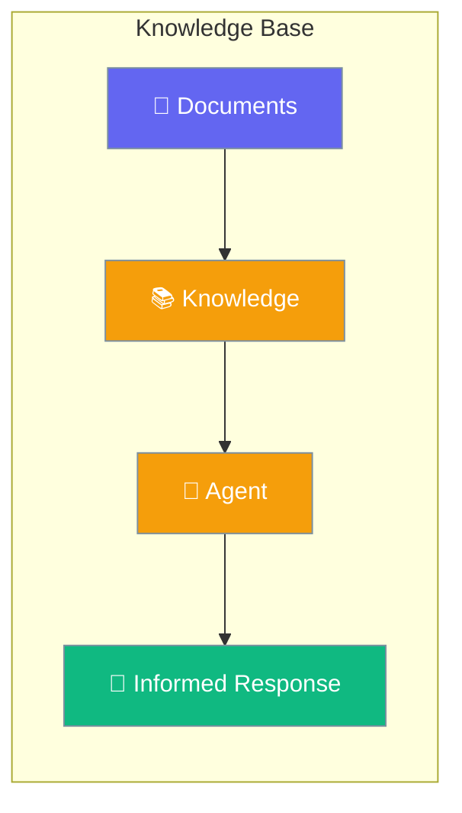
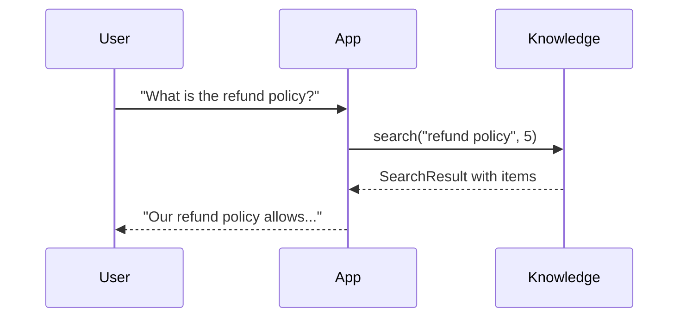

Knowledge lets agents answer questions using your documents, files, and data.



## Quick Start

<Steps>
<Step title="Create Knowledge Base">
```rust
use praisonai::{Knowledge, Document};

// Create knowledge instance
let mut knowledge = Knowledge::new().build()?;

// Add content directly
knowledge.add("Our refund policy allows returns within 30 days.", None)?;
knowledge.add("Premium members get free shipping.", None)?;
```
</Step>

<Step title="Add Documents">
```rust
use praisonai::{Knowledge, Document};

let mut knowledge = Knowledge::new().build()?;

// Create document with metadata
let doc = Document::new("Company policies and procedures...")
    .source("policies.pdf")
    .filename("policies.pdf");

knowledge.add_document(doc)?;
```
</Step>

<Step title="Search Knowledge">
```rust
use praisonai::Knowledge;

let knowledge = Knowledge::new().build()?;
// ... add content ...

// Search with limit
let results = knowledge.search("refund policy", 5)?;

for item in results.results {
    println!("{}: {}", item.score, item.text);
}
```
</Step>
</Steps>

---

## How It Works



---

## Knowledge Methods

| Method | Signature | Description |
|--------|-----------|-------------|
| `add(content, metadata)` | `fn add(&mut self, &str, Option<HashMap>) -> Result<AddResult>` | Add text content |
| `add_document(doc)` | `fn add_document(&mut self, Document) -> Result<AddResult>` | Add a document |
| `search(query, limit)` | `fn search(&self, &str, usize) -> Result<SearchResult>` | Search knowledge |
| `get(id)` | `fn get(&self, &str) -> Option<&Document>` | Get document by ID |
| `delete(id)` | `fn delete(&mut self, &str) -> bool` | Delete document |
| `clear()` | `fn clear(&mut self)` | Clear all documents |
| `len()` | `fn len(&self) -> usize` | Document count |
| `chunk(text)` | `fn chunk(&self, &str) -> Vec<String>` | Chunk text |

---

## KnowledgeBuilder Methods

| Method | Signature | Description |
|--------|-----------|-------------|
| `config(cfg)` | `fn config(KnowledgeConfig) -> Self` | Set full config |
| `chunking(cfg)` | `fn chunking(ChunkingConfig) -> Self` | Set chunking config |
| `retrieval_strategy(s)` | `fn retrieval_strategy(RetrievalStrategy) -> Self` | Set retrieval |
| `build()` | `fn build(self) -> Result<Knowledge>` | Build instance |

---

## Best Practices

<AccordionGroup>
  <Accordion title="Use specific file types">
    PDF, TXT, and MD files work best. Keep documents focused and organized.
  </Accordion>
  
  <Accordion title="Chunk size matters">
    Smaller chunks (500-1000) for specific answers, larger for context.
  </Accordion>
  
  <Accordion title="Update knowledge regularly">
    Rebuild knowledge base when documents change.
  </Accordion>
</AccordionGroup>

---

## Related

<CardGroup cols={2}>
  <Card title="Agent" icon="robot" href="/docs/rust/agent">
    Agent configuration
  </Card>
  <Card title="Memory" icon="brain" href="/docs/rust/memory">
    Conversation memory
  </Card>
</CardGroup>
