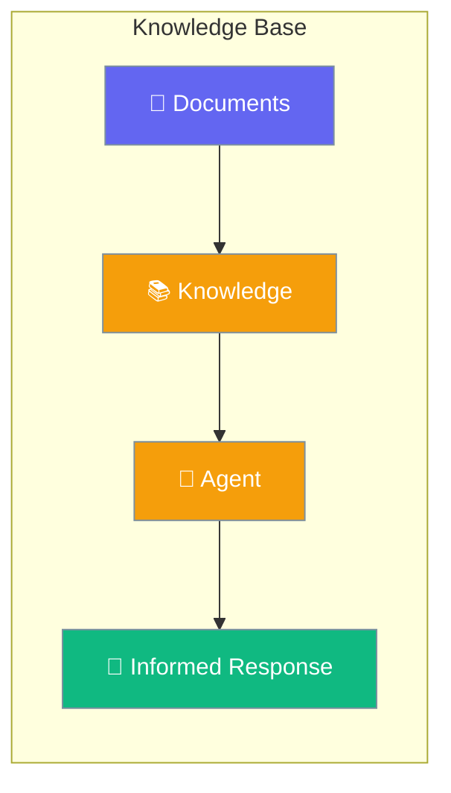
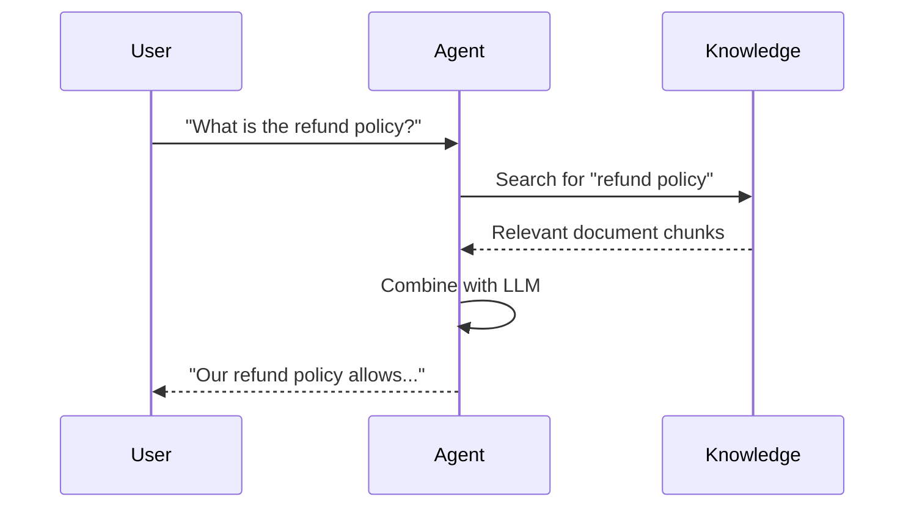

Knowledge lets agents answer questions using your documents, files, and data.



## Quick Start

<Steps>
<Step title="Add Knowledge to Agent">
```rust
use praisonai::{Agent, Knowledge};

let knowledge = Knowledge::new()
    .add_file("company_docs.pdf")
    .add_file("faq.txt")
    .build()?;

let agent = Agent::new()
    .name("Support Agent")
    .instructions("Answer using the knowledge base")
    .knowledge(knowledge)
    .build()?;

agent.chat("What is our refund policy?").await?;
// Agent searches knowledge base and responds
```
</Step>

<Step title="Add Text Directly">
```rust
use praisonai::Knowledge;

let knowledge = Knowledge::new()
    .add_text("Our refund policy allows returns within 30 days.")
    .add_text("Premium members get free shipping.")
    .build()?;
```
</Step>
</Steps>

---

## How It Works



---

## Adding Knowledge

| Method | Use Case |
|--------|----------|
| `add_file(path)` | Load PDF, TXT, MD files |
| `add_text(content)` | Add direct text content |
| `add_url(url)` | Fetch web content |
| `add_directory(path)` | Load all files in folder |

---

## Configuration

| Option | Type | Default | Description |
|--------|------|---------|-------------|
| `chunk_size` | `usize` | `1000` | Characters per chunk |
| `chunk_overlap` | `usize` | `200` | Overlap between chunks |
| `top_k` | `usize` | `5` | Results to retrieve |

---

## Best Practices

<AccordionGroup>
  <Accordion title="Use specific file types">
    PDF, TXT, and MD files work best. Keep documents focused and organized.
  </Accordion>
  
  <Accordion title="Chunk size matters">
    Smaller chunks (500-1000) for specific answers, larger for context.
  </Accordion>
  
  <Accordion title="Update knowledge regularly">
    Rebuild knowledge base when documents change.
  </Accordion>
</AccordionGroup>

---

## Related

<CardGroup cols={2}>
  <Card title="Agent" icon="robot" href="/docs/rust/agent">
    Agent configuration
  </Card>
  <Card title="Memory" icon="brain" href="/docs/rust/memory">
    Conversation memory
  </Card>
</CardGroup>
