Choose the AI model that powers your agent - OpenAI, Anthropic, local models, and more.

```mermaid
graph LR
    subgraph "LLM Providers"
        A[🤖 Agent] --> L[💭 LLM Provider]
        L --> O[OpenAI]
        L --> AN[Anthropic]
        L --> OL[Ollama]
    end
    
    classDef agent fill:#6366F1,stroke:#7C90A0,color:#fff
    classDef llm fill:#F59E0B,stroke:#7C90A0,color:#fff
    classDef provider fill:#10B981,stroke:#7C90A0,color:#fff
    
    class A agent
    class L llm
    class O,AN,OL provider
```



## Quick Start

<Steps>
<Step title="Use Default Model">
```rust
use praisonai::Agent;

// Uses gpt-4o-mini by default
let agent = Agent::new()
    .name("Assistant")
    .instructions("You are helpful")
    .build()?;
```
</Step>

<Step title="Choose a Model">
```rust
use praisonai::Agent;

let agent = Agent::new()
    .name("Assistant")
    .model("gpt-4o")  // or "claude-3-opus", "ollama/llama3"
    .build()?;
```
</Step>

<Step title="Custom API Endpoint">
```rust
use praisonai::Agent;

let agent = Agent::new()
    .name("Assistant")
    .model("llama3")
    .base_url("http://localhost:11434/v1")
    .build()?;
```
</Step>
</Steps>

---

## How It Works


---

## Choosing a Model


| Model | Best For | Speed |
|-------|----------|-------|
| `gpt-4o-mini` | Fast responses, cost effective | ⚡ Fast |
| `gpt-4o` | High quality, complex tasks | 🔵 Medium |
| `claude-3-opus` | Long documents, analysis | 🔵 Medium |
| `ollama/llama3` | Privacy, offline use | 🟢 Local |

---

## Configuration

| Option | Type | Default | Description |
|--------|------|---------|-------------|
| `model` | `String` | `gpt-4o-mini` | Model name |
| `api_key` | `String` | From ENV | API key |
| `base_url` | `String` | OpenAI default | API endpoint |
| `temperature` | `f32` | `0.7` | Randomness (0-1) |
| `max_tokens` | `u32` | None | Max response length |

---

## Best Practices

<AccordionGroup>
  <Accordion title="Use environment variables for API keys">
    Set `OPENAI_API_KEY` instead of hardcoding keys.
  </Accordion>
  
  <Accordion title="Start with gpt-4o-mini">
    Fast and cheap - upgrade to gpt-4o only when needed.
  </Accordion>
  
  <Accordion title="Use local models for privacy">
    Ollama runs models locally with no data leaving your machine.
  </Accordion>
</AccordionGroup>

---

## Related

<CardGroup cols={2}>
  <Card title="Agent" icon="robot" href="/docs/rust/agent">
    Agent configuration
  </Card>
  <Card title="Streaming" icon="stream" href="/docs/rust/streaming">
    Stream responses
  </Card>
</CardGroup>
