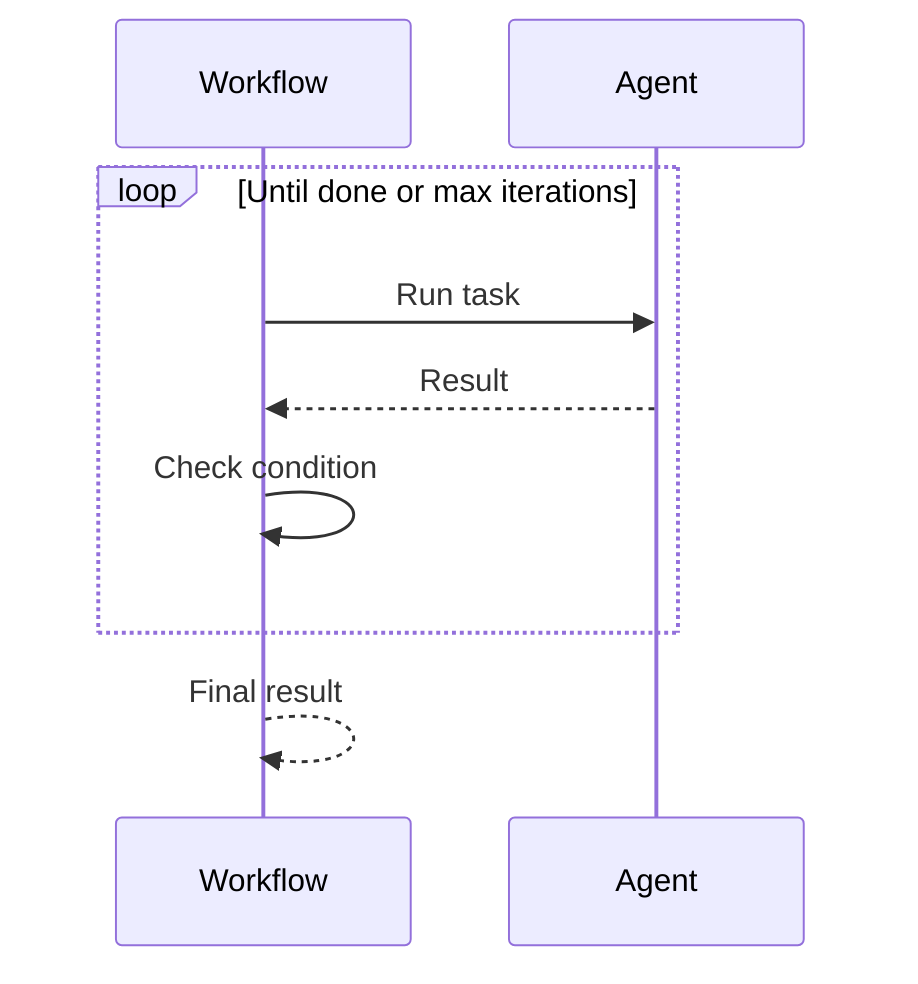

Loops let agents repeat actions until a goal is achieved.

```mermaid
graph LR
    subgraph "Loop Flow"
        S[Start] --> A[🤖 Action]
        A --> C{Done?}
        C --> |No| A
        C --> |Yes| E[✅ End]
    end
    
    classDef start fill:#6366F1,stroke:#7C90A0,color:#fff
    classDef action fill:#F59E0B,stroke:#7C90A0,color:#fff
    classDef end fill:#10B981,stroke:#7C90A0,color:#fff
    
    class S start
    class A,C action
    class E end
```

## Quick Start

<Steps>
<Step title="Simple Loop">
```rust
use praisonai::r#loop;

let workflow = r#loop(agent)
    .until(|result| result.contains("DONE"))
    .max_iterations(5);

workflow.run("Keep improving until satisfied").await?;
```
</Step>

<Step title="With Counter">
```rust
use praisonai::r#loop;

let workflow = r#loop(agent)
    .times(3);  // Run exactly 3 times

workflow.run("Generate 3 ideas").await?;
```
</Step>
</Steps>

---

## How It Works



---

## Configuration

| Option | Type | Default | Description |
|--------|------|---------|-------------|
| `max_iterations` | `usize` | `10` | Maximum loop count |
| `until` | `Fn` | None | Stop condition |
| `times` | `usize` | None | Fixed iteration count |

---

## Common Patterns

### Refinement Loop

```rust
use praisonai::r#loop;

// Keep improving until quality is good
let workflow = r#loop(editor)
    .until(|result| quality_score(result) > 0.9)
    .max_iterations(5);
```

### Retry Pattern

```rust
use praisonai::r#loop;

// Retry until success
let workflow = r#loop(api_caller)
    .until(|result| !result.contains("error"))
    .max_iterations(3);
```

---

## Best Practices

<AccordionGroup>
  <Accordion title="Always set max_iterations">
    Prevents infinite loops from runaway agents.
  </Accordion>
  
  <Accordion title="Use clear exit conditions">
    Make stop conditions obvious and testable.
  </Accordion>
</AccordionGroup>

---

## Related

<CardGroup cols={2}>
  <Card title="Conditions" icon="code-branch" href="/docs/rust/conditions">
    Conditional logic
  </Card>
  <Card title="Parallel" icon="bolt" href="/docs/rust/parallel-execution">
    Parallel execution
  </Card>
</CardGroup>
