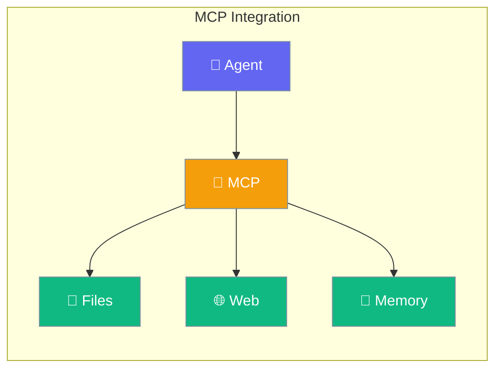
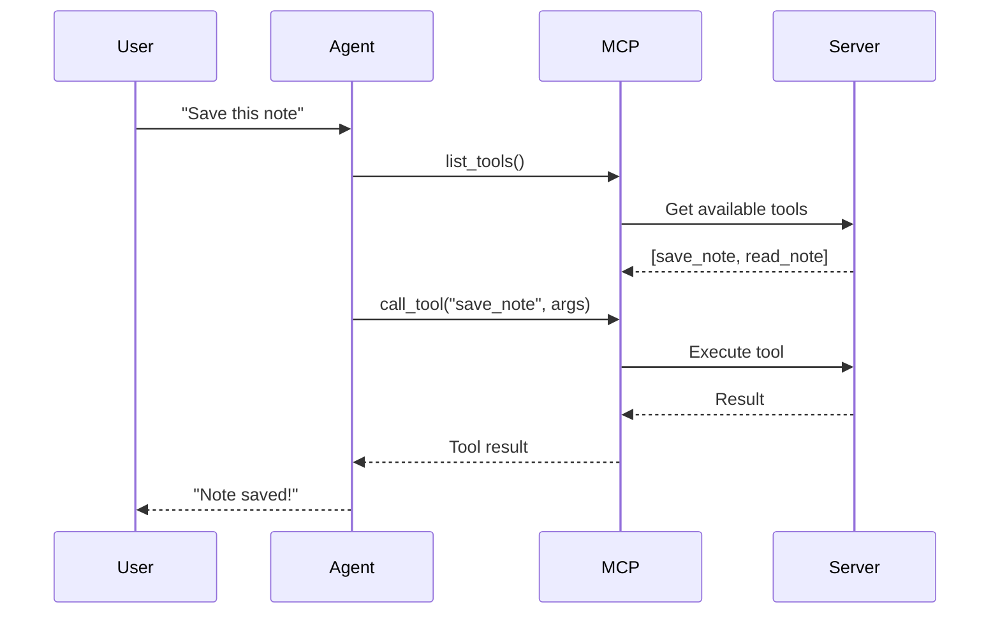
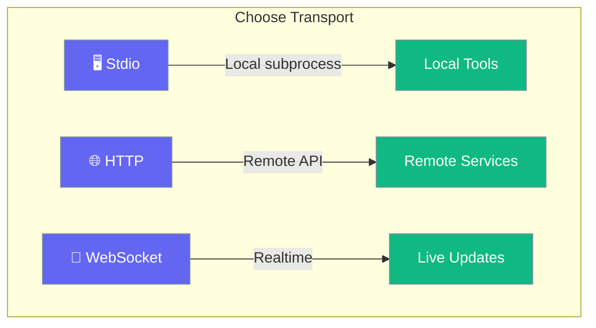

MCP (Model Context Protocol) connects your agent to external tools and services with zero code.



## Quick Start

<Steps>
<Step title="Connect MCP Server">
```rust
use praisonai::{Agent, MCP};

let agent = Agent::new()
    .name("Assistant")
    .instructions("Use MCP tools when needed")
    .mcp("npx", &["-y", "@anthropic/mcp-server-memory"])
    .build()?;

agent.chat("Remember that my favorite color is blue").await?;
```
</Step>

<Step title="Multiple MCP Servers">
```rust
use praisonai::{Agent, MCP};

let agent = Agent::new()
    .name("Assistant")
    .mcp("npx", &["-y", "@anthropic/mcp-server-memory"])
    .mcp("npx", &["-y", "@anthropic/mcp-server-filesystem"])
    .build()?;
```
</Step>
</Steps>

---

## How It Works



---

## Transport Types

Choose how to connect to MCP servers:



| Transport | Use Case | Example |
|-----------|----------|---------|
| `Stdio` | Local subprocess | `npx @anthropic/mcp-server-*` |
| `HTTP` | Remote API | `https://api.example.com/mcp` |
| `WebSocket` | Realtime connection | `wss://live.example.com/mcp` |

---

## Configuration Options

| Option | Type | Default | Description |
|--------|------|---------|-------------|
| `transport_type` | `TransportType` | `Stdio` | Connection method |
| `command` | `String` | - | Command for Stdio |
| `args` | `Vec<String>` | `[]` | Command arguments |
| `url` | `String` | - | URL for HTTP/WebSocket |
| `timeout` | `u32` | `30` | Connection timeout (seconds) |

---

## Popular MCP Servers

| Server | Purpose | Command |
|--------|---------|---------|
| Memory | Persistent memory | `@anthropic/mcp-server-memory` |
| Filesystem | File operations | `@anthropic/mcp-server-filesystem` |
| Fetch | HTTP requests | `@anthropic/mcp-server-fetch` |
| GitHub | GitHub API | `@anthropic/mcp-server-github` |

---

## Best Practices

<AccordionGroup>
  <Accordion title="Use Stdio for local tools">
    Stdio transport is simplest and most reliable for local MCP servers.
  </Accordion>
  
  <Accordion title="Set appropriate timeouts">
    Increase timeout for slow-starting servers or remote connections.
  </Accordion>
  
  <Accordion title="Combine multiple servers">
    Chain servers for rich capabilities - memory + filesystem + web.
  </Accordion>
</AccordionGroup>

---

## Related

<CardGroup cols={2}>
  <Card title="Tools" icon="wrench" href="/docs/rust/tools">
    Custom tools
  </Card>
  <Card title="Agent" icon="robot" href="/docs/rust/agent">
    Agent configuration
  </Card>
</CardGroup>
