MCP (Model Context Protocol) connects your agent to external tools and services with zero code.

```mermaid
graph LR
    subgraph "MCP Integration"
        A[🤖 Agent] --> M[🔌 MCP]
        M --> T1[📁 Files]
        M --> T2[🌐 Web]
        M --> T3[💾 Memory]
    end
    
    classDef agent fill:#6366F1,stroke:#7C90A0,color:#fff
    classDef mcp fill:#F59E0B,stroke:#7C90A0,color:#fff
    classDef tool fill:#10B981,stroke:#7C90A0,color:#fff
    
    class A agent
    class M mcp
    class T1,T2,T3 tool
```



## Quick Start

<Steps>
<Step title="Create MCP Client">
```rust
use praisonai::{MCP, MCPBuilder};

// Create MCP client for memory server
let mcp = MCP::new()
    .name("memory")
    .server("npx", &["-y", "@anthropic/mcp-server-memory"])
    .build()?;

// Connect to the server
mcp.connect().await?;

// List available tools
let tools = mcp.list_tools().await?;
```
</Step>

<Step title="HTTP Transport">
```rust
use praisonai::{MCP, MCPBuilder};

// Connect to remote MCP server
let mcp = MCP::new()
    .name("remote")
    .http("https://api.example.com/mcp")
    .build()?;

mcp.connect().await?;
```
</Step>

<Step title="WebSocket Transport">
```rust
use praisonai::{MCP, MCPBuilder};

// Real-time MCP connection
let mcp = MCP::new()
    .name("realtime")
    .websocket("wss://live.example.com/mcp")
    .build()?;

mcp.connect().await?;
```
</Step>
</Steps>

---

## How It Works


---

## Transport Types

Choose how to connect to MCP servers:

```mermaid
graph TB
    subgraph "Choose Transport"
        S[🖥️ Stdio] --> |Local subprocess| L[Local Tools]
        H[🌐 HTTP] --> |Remote API| R[Remote Services]
        W[🔌 WebSocket] --> |Realtime| RT[Live Updates]
    end
    
    classDef transport fill:#6366F1,stroke:#7C90A0,color:#fff
    classDef target fill:#10B981,stroke:#7C90A0,color:#fff
    
    class S,H,W transport
    class L,R,RT target
```



| Transport | Use Case | Example |
|-----------|----------|---------|
| `Stdio` | Local subprocess | `npx @anthropic/mcp-server-*` |
| `HTTP` | Remote API | `https://api.example.com/mcp` |
| `WebSocket` | Realtime connection | `wss://live.example.com/mcp` |

---

## Configuration Options

### MCPBuilder Methods

| Method | Signature | Description |
|--------|-----------|-------------|
| `name(n)` | `fn name(impl Into<String>) -> Self` | Set server name |
| `server(cmd, args)` | `fn server(impl Into<String>, &[&str]) -> Self` | Stdio transport |
| `http(url)` | `fn http(impl Into<String>) -> Self` | HTTP transport |
| `websocket(url)` | `fn websocket(impl Into<String>) -> Self` | WebSocket transport |
| `config(cfg)` | `fn config(MCPConfig) -> Self` | Set full config |
| `security(sec)` | `fn security(SecurityConfig) -> Self` | Set security |
| `build()` | `fn build(self) -> Result<MCP>` | Build client |

### MCP Methods

| Method | Signature | Description |
|--------|-----------|-------------|
| `connect()` | `async fn connect(&mut self) -> Result<()>` | Connect to server |
| `disconnect()` | `async fn disconnect(&mut self) -> Result<()>` | Disconnect |
| `is_connected()` | `fn is_connected(&self) -> bool` | Check connection |
| `list_tools()` | `async fn list_tools(&self) -> Result<Vec<MCPTool>>` | List available tools |
| `list_resources()` | `async fn list_resources(&self) -> Result<Vec<MCPResource>>` | List resources |
| `list_prompts()` | `async fn list_prompts(&self) -> Result<Vec<MCPPrompt>>` | List prompts |
| `call_tool(call)` | `async fn call_tool(&self, MCPCall) -> Result<MCPCallResult>` | Execute tool |
| `read_resource(uri)` | `async fn read_resource(&self, &str) -> Result<MCPContent>` | Read resource |

---

## Popular MCP Servers

| Server | Purpose | Command |
|--------|---------|---------|
| Memory | Persistent memory | `@anthropic/mcp-server-memory` |
| Filesystem | File operations | `@anthropic/mcp-server-filesystem` |
| Fetch | HTTP requests | `@anthropic/mcp-server-fetch` |
| GitHub | GitHub API | `@anthropic/mcp-server-github` |

---

## Best Practices

<AccordionGroup>
  <Accordion title="Use Stdio for local tools">
    Stdio transport is simplest and most reliable for local MCP servers.
  </Accordion>
  
  <Accordion title="Set appropriate timeouts">
    Increase timeout for slow-starting servers or remote connections.
  </Accordion>
  
  <Accordion title="Combine multiple servers">
    Chain servers for rich capabilities - memory + filesystem + web.
  </Accordion>
</AccordionGroup>

---

## Related

<CardGroup cols={2}>
  <Card title="Tools" icon="wrench" href="/docs/rust/tools">
    Custom tools
  </Card>
  <Card title="Agent" icon="robot" href="/docs/rust/agent">
    Agent configuration
  </Card>
</CardGroup>
