Memory stores conversation history, enabling agents to maintain context across interactions.

```mermaid
graph LR
    subgraph "Memory System"
        A[🤖 Agent] --> M[🧠 Memory]
        M --> S[💬 Short-term]
        M --> L[📚 Long-term]
    end
    
    classDef agent fill:#6366F1,stroke:#7C90A0,color:#fff
    classDef memory fill:#F59E0B,stroke:#7C90A0,color:#fff
    classDef store fill:#10B981,stroke:#7C90A0,color:#fff
    
    class A agent
    class M memory
    class S,L store
```



## Quick Start

<Steps>
<Step title="Enable Agent Memory">
```rust
use praisonai::Agent;

let agent = Agent::new()
    .name("Assistant")
    .instructions("Remember our conversation")
    .memory(true)  // Enable memory
    .build()?;

// Conversation context persists between calls
agent.chat("My name is Alice").await?;
let response = agent.chat("What's my name?").await?;
// response: "Your name is Alice"
```
</Step>

<Step title="Clear Memory">
```rust
use praisonai::Agent;

let agent = Agent::new()
    .name("Assistant")
    .memory(true)
    .build()?;

agent.chat("Remember: secret code is 1234").await?;
agent.clear_memory().await?;
agent.chat("What's the secret code?").await?;
// Agent no longer remembers the code
```
</Step>
</Steps>

---

## User Interaction Flow


---

## Memory

Main memory manager for agents.

```rust
pub struct Memory {
    adapter: Box<dyn MemoryAdapter>,
    config: MemoryConfig,
}
```

### Factory Methods

| Method | Signature | Description |
|--------|-----------|-------------|
| `new(adapter, config)` | `fn new(impl MemoryAdapter, MemoryConfig) -> Self` | Create with custom adapter |
| `in_memory(config)` | `fn in_memory(MemoryConfig) -> Self` | Create in-memory storage |
| `default_memory()` | `fn default_memory() -> Self` | Create with default config |

### Instance Methods

| Method | Signature | Description |
|--------|-----------|-------------|
| `store(message)` | `async fn store(&mut self, Message) -> Result<()>` | Store a message |
| `history()` | `async fn history(&self) -> Result<Vec<Message>>` | Get conversation history |
| `search(query, limit)` | `async fn search(&self, &str, usize) -> Result<Vec<Message>>` | Search messages |
| `clear()` | `async fn clear(&mut self) -> Result<()>` | Clear all memory |
| `config()` | `fn config(&self) -> &MemoryConfig` | Get config reference |

---

## MemoryConfig

Configuration for memory behavior.

```rust
pub struct MemoryConfig {
    pub use_short_term: bool,
    pub max_messages: usize,
}
```

### Configuration Options

| Option | Type | Default | Description |
|--------|------|---------|-------------|
| `use_short_term` | `bool` | `true` | Enable short-term memory |
| `max_messages` | `usize` | `100` | Max messages to retain |

---

## ConversationHistory

Low-level message storage with automatic trimming.

```rust
pub struct ConversationHistory {
    messages: VecDeque<Message>,
    max_messages: usize,
}
```

### Methods

| Method | Signature | Description |
|--------|-----------|-------------|
| `new(max)` | `fn new(usize) -> Self` | Create with max messages |
| `add(message)` | `fn add(&mut self, Message)` | Add message (auto-trims) |
| `messages()` | `fn messages(&self) -> Vec<Message>` | Get all messages |
| `clear()` | `fn clear(&mut self)` | Clear all messages |
| `len()` | `fn len(&self) -> usize` | Message count |
| `is_empty()` | `fn is_empty(&self) -> bool` | Check if empty |

> **Note:** When trimming, system messages are preserved - only user/assistant messages are removed.

---

## MemoryAdapter Trait

Interface for custom memory backends.

```rust
#[async_trait]
pub trait MemoryAdapter: Send + Sync {
    async fn store_short_term(&mut self, message: Message) -> Result<()>;
    async fn search_short_term(&self, query: &str, limit: usize) -> Result<Vec<Message>>;
    async fn get_short_term(&self) -> Result<Vec<Message>>;
    async fn clear_short_term(&mut self) -> Result<()>;
    
    // Optional long-term methods (default no-op)
    async fn store_long_term(&mut self, text: &str, metadata: Option<Value>) -> Result<()>;
    async fn search_long_term(&self, query: &str, limit: usize) -> Result<Vec<String>>;
}
```

---

## InMemoryAdapter

Default in-memory implementation.

```rust
pub struct InMemoryAdapter {
    history: ConversationHistory,
}
```

### Methods

| Method | Signature | Description |
|--------|-----------|-------------|
| `new(max)` | `fn new(usize) -> Self` | Create with max messages |
| `default()` | `fn default() -> Self` | Create with 100 max messages |

---

## Custom Memory Adapter

```rust
use praisonai::{MemoryAdapter, Message, async_trait, Result};

struct RedisMemory {
    client: redis::Client,
}

#[async_trait]
impl MemoryAdapter for RedisMemory {
    async fn store_short_term(&mut self, message: Message) -> Result<()> {
        // Store to Redis
        Ok(())
    }
    
    async fn search_short_term(&self, query: &str, limit: usize) -> Result<Vec<Message>> {
        // Search Redis
        Ok(vec![])
    }
    
    async fn get_short_term(&self) -> Result<Vec<Message>> {
        // Get from Redis
        Ok(vec![])
    }
    
    async fn clear_short_term(&mut self) -> Result<()> {
        // Clear Redis keys
        Ok(())
    }
}
```

---

## Best Practices

<AccordionGroup>
  <Accordion title="Set appropriate max_messages">
    Too many messages increase token usage and cost. Start with 50-100.
  </Accordion>
  
  <Accordion title="Clear memory for new contexts">
    Use `clear_memory()` when starting unrelated conversations.
  </Accordion>
  
  <Accordion title="System messages are preserved">
    The trimming algorithm keeps system messages - only user/assistant messages are removed when exceeding limits.
  </Accordion>
  
  <Accordion title="Use search for relevant context">
    For long histories, use `search()` to find relevant past messages instead of loading everything.
  </Accordion>
</AccordionGroup>

---

## Related

<CardGroup cols={2}>
  <Card title="Agent" icon="robot" href="/docs/rust/agent">
    Agent API
  </Card>
  <Card title="Sessions" icon="user" href="/docs/rust/sessions">
    Session persistence
  </Card>
</CardGroup>
