Memory stores conversation history and enables context-aware agents.

```mermaid
graph LR
    subgraph "Memory System"
        A[💬 Message] --> B[📦 Store]
        B --> C[🔍 Search]
        C --> D[📋 History]
        D --> E[🤖 Agent]
    end
    
    classDef msg fill:#6366F1,stroke:#7C90A0,color:#fff
    classDef store fill:#F59E0B,stroke:#7C90A0,color:#fff
    classDef agent fill:#8B0000,stroke:#7C90A0,color:#fff
    
    class A msg
    class B,C,D store
    class E agent
```



## Quick Start

<Steps>

<Step title="Automatic Memory">
Agents have memory enabled by default:

```rust
use praisonai::Agent;

let agent = Agent::simple("Remember our conversation")?;

agent.chat("My name is Alice").await?;
let response = agent.chat("What's my name?").await?;
// Agent remembers: "Alice"
```
</Step>

<Step title="Clear Memory">
```rust
agent.clear_memory().await?;
```
</Step>

</Steps>

---

## Memory Components

### ConversationHistory

Stores messages with automatic trimming:

```rust
use praisonai::memory::ConversationHistory;

let mut history = ConversationHistory::new(100); // max 100 messages

history.add(Message::user("Hello"));
history.add(Message::assistant("Hi there!"));

let messages = history.messages();
history.clear();
```

### Memory Manager

The `Memory` struct manages conversation storage:

```rust
use praisonai::memory::{Memory, MemoryConfig};

let memory = Memory::in_memory(MemoryConfig::default());

// Store messages
memory.store(Message::user("Hello")).await?;

// Get full history
let history = memory.history().await?;

// Search messages
let results = memory.search("keyword", 10).await?;

// Clear all
memory.clear().await?;
```

---

## MemoryAdapter Trait

Implement custom storage backends:

```rust
use praisonai::memory::MemoryAdapter;
use async_trait::async_trait;

struct RedisAdapter {
    // Redis connection
}

#[async_trait]
impl MemoryAdapter for RedisAdapter {
    async fn store_short_term(&mut self, message: Message) -> Result<()> {
        // Store in Redis
        Ok(())
    }
    
    async fn get_short_term(&self) -> Result<Vec<Message>> {
        // Fetch from Redis
        Ok(vec![])
    }
    
    async fn search_short_term(&self, query: &str, limit: usize) -> Result<Vec<Message>> {
        // Search Redis
        Ok(vec![])
    }
    
    async fn clear_short_term(&mut self) -> Result<()> {
        // Clear Redis
        Ok(())
    }
}
```

---

## Configuration

```rust
use praisonai::config::MemoryConfig;

let config = MemoryConfig {
    use_short_term: true,  // Enable conversation memory
    max_messages: 100,     // Max messages to keep
};
```

| Option | Type | Default | Description |
|--------|------|---------|-------------|
| `use_short_term` | `bool` | `true` | Enable short-term memory |
| `max_messages` | `usize` | `100` | Maximum messages to retain |

---

## Built-in Adapters

| Adapter | Description |
|---------|-------------|
| `InMemoryAdapter` | Default, stores in RAM |

---

## Best Practices

<AccordionGroup>
  <Accordion title="Set appropriate limits">
    Use `max_messages` to prevent unbounded memory growth.
  </Accordion>
  
  <Accordion title="Clear when needed">
    Call `clear()` to start fresh conversations.
  </Accordion>
  
  <Accordion title="System messages preserved">
    Trimming keeps system messages, removes oldest user/assistant messages first.
  </Accordion>
</AccordionGroup>

---

## Related

<CardGroup cols={2}>
  <Card title="Agent" icon="robot" href="/docs/rust/agent">
    Agents use memory automatically
  </Card>
  <Card title="AgentTeam" icon="users" href="/docs/rust/agent-team">
    Multi-agent coordination
  </Card>
</CardGroup>
