OCRAgent extracts text from documents and images using AI models.

```mermaid
graph LR
    subgraph "OCR Pipeline"
        D[📄 Document] --> A[🤖 OCRAgent]
        A --> T[📝 Text]
    end
    
    classDef input fill:#6366F1,stroke:#7C90A0,color:#fff
    classDef agent fill:#F59E0B,stroke:#7C90A0,color:#fff
    classDef output fill:#10B981,stroke:#7C90A0,color:#fff
    
    class D input
    class A agent
    class T output
```



## Quick Start

<Steps>
<Step title="Create OCR Agent">
```rust
use praisonai::agents::OCRAgent;

let agent = OCRAgent::new()
    .name("DocumentReader")
    .model("mistral/mistral-ocr-latest")
    .build()?;
```
</Step>

<Step title="Extract Text">
```rust
let result = agent.extract("document.pdf")?;

println!("Extracted: {}", result.text);

for page in &result.pages {
    println!("Page {}: {}", page.page_number, page.markdown);
}
```
</Step>

<Step title="With Configuration">
```rust
use praisonai::agents::{OCRAgent, OCRConfig};

let config = OCRConfig::new()
    .pages(vec![1, 2, 3])
    .image_limit(10)
    .include_images(true);

let agent = OCRAgent::new()
    .config(config)
    .build()?;
```
</Step>
</Steps>

---

## Configuration Options

```rust
use praisonai::agents::OCRConfig;

let config = OCRConfig::new()
    .pages(vec![1, 2])
    .image_limit(5)
    .include_images(true);
```

| Option | Type | Default | Description |
|--------|------|---------|-------------|
| `pages` | `Option<Vec<u32>>` | `None` | Specific pages |
| `image_limit` | `Option<u32>` | `None` | Max images to extract |
| `include_images` | `bool` | `false` | Include images in output |
| `timeout` | `u32` | `60` | Timeout in seconds |

---

## OCRResult

```rust
pub struct OCRResult {
    pub text: String,
    pub pages: Vec<OCRPage>,
}

pub struct OCRPage {
    pub page_number: u32,
    pub markdown: String,
    pub images: Vec<String>,
}
```

---

## Best Practices

<AccordionGroup>
  <Accordion title="Use specific pages">
    Extract only needed pages to reduce processing time.
  </Accordion>
  
  <Accordion title="Limit image extraction">
    Set `image_limit` to avoid excessive memory usage.
  </Accordion>
</AccordionGroup>

---

## Related

<CardGroup cols={2}>
  <Card title="Vision" icon="eye" href="/docs/rust/vision">
    Image understanding
  </Card>
  <Card title="Documents" icon="file" href="/docs/rust/documents">
    Document processing
  </Card>
</CardGroup>
