OCR (Optical Character Recognition) extracts text from images.

```mermaid
graph LR
    subgraph "OCR"
        I[🖼️ Image] --> O[👁️ OCR]
        O --> T[📝 Text]
        T --> A[🤖 Agent]
    end
    
    classDef image fill:#6366F1,stroke:#7C90A0,color:#fff
    classDef text fill:#10B981,stroke:#7C90A0,color:#fff
    
    class I image
    class O,T,A text
```



## Quick Start

<Steps>
<Step title="Process Image">
```rust
use praisonai::{Agent, tool};

#[tool]
async fn extract_text(image_path: String) -> String {
    // OCR processing
    ocr::extract(&image_path).await
}

let agent = Agent::new()
    .name("Reader")
    .tool(extract_text)
    .build()?;

agent.chat("Read the text from screenshot.png").await?;
```
</Step>
</Steps>

---

## Supported Formats

| Format | Extension |
|--------|-----------|
| PNG | `.png` |
| JPEG | `.jpg`, `.jpeg` |
| PDF (scanned) | `.pdf` |
| TIFF | `.tiff` |

---

## Related

<CardGroup cols={2}>
  <Card title="Documents" icon="file-lines" href="/docs/rust/documents">
    Document processing
  </Card>
  <Card title="Images" icon="image" href="/docs/rust/image">
    Image generation
  </Card>
</CardGroup>
