Optimizer improves agent performance through iterative refinement.

```mermaid
graph LR
    subgraph "Optimization Loop"
        A[🤖 Agent] --> E[📊 Evaluate]
        E --> O[🔧 Optimize]
        O --> A
    end
    
    classDef agent fill:#6366F1,stroke:#7C90A0,color:#fff
    classDef process fill:#F59E0B,stroke:#7C90A0,color:#fff
    
    class A agent
    class E,O process
```

## Overview

The optimizer refines agent behavior based on evaluation results.

## Workflow

1. **Execute** - Run agent on task
2. **Evaluate** - Score the output
3. **Analyze** - Identify improvements
4. **Optimize** - Apply refinements
5. **Repeat** - Iterate until threshold

---

## Best Practices

<AccordionGroup>
  <Accordion title="Set clear criteria">
    Define measurable optimization goals.
  </Accordion>
  
  <Accordion title="Limit iterations">
    Set maximum iterations to prevent infinite loops.
  </Accordion>
</AccordionGroup>

---

## Related

<CardGroup cols={2}>
  <Card title="Evaluation" icon="chart-bar" href="/docs/rust/evaluation">
    Performance evaluation
  </Card>
  <Card title="Reflection" icon="mirror" href="/docs/rust/reflection">
    Self-improvement
  </Card>
</CardGroup>
