Optimize agent outputs using the evaluation system to measure, compare, and improve results.

```mermaid
graph LR
    subgraph "Optimization Cycle"
        A[🤖 Agent] --> O[📊 Evaluate]
        O --> S[📈 Score]
        S --> I[🔄 Iterate]
        I --> A
    end
    
    classDef agent fill:#6366F1,stroke:#7C90A0,color:#fff
    classDef eval fill:#F59E0B,stroke:#7C90A0,color:#fff
    classDef score fill:#10B981,stroke:#7C90A0,color:#fff
    
    class A agent
    class O,I eval
    class S score
```



## Quick Start

<Steps>
<Step title="Evaluate Agent Output">
```rust
use praisonai::{Agent, AccuracyEvaluator};

// Create agent
let agent = Agent::new()
    .name("Writer")
    .instructions("Write concise summaries")
    .build()?;

// Get output
let output = agent.start("Summarize quantum computing").await?;

// Evaluate accuracy
let evaluator = AccuracyEvaluator::new()
    .input("Summarize quantum computing")
    .expected("Quantum computing uses qubits for parallel processing")
    .threshold(0.7)
    .build();

let result = evaluator.evaluate_simple(&output);
println!("Score: {} | Passed: {}", result.score.value, result.passed);
```
</Step>

<Step title="Criteria-Based Evaluation">
```rust
use praisonai::{CriteriaEvaluator, CriteriaScore};
use std::collections::HashMap;

let evaluator = CriteriaEvaluator::new()
    .criterion("accuracy")
    .criterion("clarity")
    .criterion("completeness")
    .threshold(0.7)
    .build();

// Score each criterion
let mut scores = HashMap::new();
scores.insert("accuracy".to_string(), 0.9);
scores.insert("clarity".to_string(), 0.8);
scores.insert("completeness".to_string(), 0.75);

let result = evaluator.evaluate(&scores);
println!("Overall: {} | Passed: {}", result.score.value, result.passed);
```
</Step>
</Steps>

---

## User Interaction Flow


---

## AccuracyEvaluator

Compare output against expected results.

```rust
pub struct AccuracyEvaluator {
    input: String,
    expected: String,
    config: EvaluatorConfig,
}
```

### Builder Methods

| Method | Signature | Description |
|--------|-----------|-------------|
| `new()` | `fn new() -> AccuracyEvaluatorBuilder` | Create builder |
| `input(text)` | `fn input(impl Into<String>) -> Self` | Set input |
| `expected(text)` | `fn expected(impl Into<String>) -> Self` | Set expected output |
| `threshold(n)` | `fn threshold(f64) -> Self` | Pass threshold (0.0-1.0) |
| `build()` | `fn build(self) -> AccuracyEvaluator` | Build evaluator |

### Evaluation

```rust
let result = evaluator.evaluate_simple(&actual_output);
// result.score.value = 0.0-1.0
// result.passed = true/false
```

---

## CriteriaEvaluator

Evaluate against custom criteria with weighted scores.

```rust
pub struct CriteriaEvaluator {
    criteria: Vec<String>,
    config: EvaluatorConfig,
}
```

### Builder Methods

| Method | Signature | Description |
|--------|-----------|-------------|
| `new()` | `fn new() -> CriteriaEvaluatorBuilder` | Create builder |
| `criterion(name)` | `fn criterion(impl Into<String>) -> Self` | Add criterion |
| `threshold(n)` | `fn threshold(f64) -> Self` | Pass threshold |
| `build()` | `fn build(self) -> CriteriaEvaluator` | Build evaluator |

### Example

```rust
use praisonai::CriteriaEvaluator;
use std::collections::HashMap;

let evaluator = CriteriaEvaluator::new()
    .criterion("relevance")
    .criterion("coherence")
    .threshold(0.75)
    .build();

let mut scores = HashMap::new();
scores.insert("relevance".to_string(), 0.9);
scores.insert("coherence".to_string(), 0.8);

let result = evaluator.evaluate(&scores);
```

---

## PerformanceEvaluator

Measure execution performance.

```rust
pub struct PerformanceEvaluator {
    max_duration: Duration,
    max_ttft: Option<Duration>,
    config: EvaluatorConfig,
}
```

### Configuration

| Option | Type | Default | Description |
|--------|------|---------|-------------|
| `max_duration` | `Duration` | 30s | Maximum allowed time |
| `max_ttft` | `Option<Duration>` | None | Max time-to-first-token |
| `threshold` | `f64` | 0.7 | Pass threshold |

### Example

```rust
use praisonai::{PerformanceEvaluator, PerformanceMetrics};
use std::time::Duration;

let evaluator = PerformanceEvaluator::new()
    .max_duration(Duration::from_secs(10))
    .threshold(0.8)
    .build();

let metrics = PerformanceMetrics::new(Duration::from_secs(5));
let result = evaluator.evaluate(&metrics);
```

---

## Judge

LLM-based evaluation for complex judgments.

```rust
pub struct Judge {
    pub name: String,
    pub config: JudgeConfig,
    pub threshold: f64,
}
```

### Configuration

| Option | Type | Default | Description |
|--------|------|---------|-------------|
| `model` | `String` | `"gpt-4o-mini"` | Model for judging |
| `temperature` | `f64` | `0.0` | LLM temperature |
| `system_prompt` | `Option<String>` | None | Custom system prompt |

### Example

```rust
use praisonai::Judge;

let judge = Judge::new("quality-judge")
    .with_threshold(0.8);

let result = judge.judge(
    "Explain quantum computing",
    &agent_output,
    Some("Expected explanation of qubits and superposition")
);

println!("Score: {} | Reason: {}", result.score, result.reasoning);
```

---

## Optimization Loop Pattern

```rust
use praisonai::{Agent, AccuracyEvaluator};

let agent = Agent::new()
    .name("Writer")
    .build()?;

let evaluator = AccuracyEvaluator::new()
    .expected("Clear, concise explanation")
    .threshold(0.8)
    .build();

let mut output = agent.start("Explain AI").await?;
let mut result = evaluator.evaluate_simple(&output);

// Iterate until passing
while !result.passed {
    let feedback = format!(
        "Previous score: {}. Improve clarity and accuracy.",
        result.score.value
    );
    output = agent.start(&feedback).await?;
    result = evaluator.evaluate_simple(&output);
}

println!("Final output (score {}): {}", result.score.value, output);
```

---

## Best Practices

<AccordionGroup>
  <Accordion title="Define clear evaluation criteria">
    Use specific, measurable criteria for consistent evaluation.
  </Accordion>
  
  <Accordion title="Set appropriate thresholds">
    Start with 0.7-0.8 threshold and adjust based on use case.
  </Accordion>
  
  <Accordion title="Combine evaluators for comprehensive assessment">
    Use AccuracyEvaluator + PerformanceEvaluator for complete picture.
  </Accordion>
  
  <Accordion title="Log iteration history">
    Track scores across iterations to identify improvement patterns.
  </Accordion>
</AccordionGroup>

---

## Related

<CardGroup cols={2}>
  <Card title="Evaluation" icon="check-circle" href="/docs/rust/evaluation">
    Evaluation system
  </Card>
  <Card title="Agent" icon="robot" href="/docs/rust/agent">
    Agent API
  </Card>
</CardGroup>
