Output controls how agent responses are formatted and displayed.

```mermaid
graph LR
    subgraph "Output Pipeline"
        R[📝 Raw] --> F[🎨 Format]
        F --> D[📺 Display]
    end
    
    classDef raw fill:#6366F1,stroke:#7C90A0,color:#fff
    classDef format fill:#F59E0B,stroke:#7C90A0,color:#fff
    classDef display fill:#10B981,stroke:#7C90A0,color:#fff
    
    class R raw
    class F format
    class D display
```



## Quick Start

<Steps>
<Step title="Set Output Format">
```rust
use praisonai::{Agent, OutputFormat};

let agent = Agent::new()
    .output_format(OutputFormat::Json)
    .build()?;
```
</Step>

<Step title="Structured Output">
```rust
use praisonai::output::OutputConfig;

let agent = Agent::new()
    .output(OutputConfig::new()
        .format(OutputFormat::Json)
        .schema(r#"{"type": "object"}"#)
        .pretty(true))
    .build()?;
```
</Step>
</Steps>

---

## Output Formats

| Format | Description |
|--------|-------------|
| `Text` | Plain text (default) |
| `Json` | JSON object |
| `Markdown` | Markdown formatted |
| `Structured` | Custom schema |

---

## Configuration Options

| Option | Type | Default | Description |
|--------|------|---------|-------------|
| `format` | `OutputFormat` | `Text` | Output format |
| `schema` | `str` | `None` | JSON schema |
| `pretty` | `bool` | `false` | Pretty print |

---

## Best Practices

<AccordionGroup>
  <Accordion title="Use JSON for structured data">
    When you need to parse output programmatically, use JSON format.
  </Accordion>
  
  <Accordion title="Define schemas for reliability">
    Use JSON schemas to ensure consistent output structure.
  </Accordion>
</AccordionGroup>

---

## Related

<CardGroup cols={2}>
  <Card title="Display" icon="desktop" href="/docs/rust/display">
    Display callbacks
  </Card>
  <Card title="Agent" icon="robot" href="/docs/rust/agent">
    Agent API
  </Card>
</CardGroup>
