Configure output format - silent, verbose, or JSON.

```mermaid
graph LR
    subgraph "Output Modes"
        A[🤖 Agent] --> O{Output}
        O --> S[🔇 Silent]
        O --> V[📢 Verbose]
        O --> J[📋 JSON]
    end
    
    classDef agent fill:#6366F1,stroke:#7C90A0,color:#fff
    classDef mode fill:#10B981,stroke:#7C90A0,color:#fff
    
    class A agent
    class O,S,V,J mode
```



## Quick Start

<Steps>
<Step title="Verbose Output (Default)">
```rust
use praisonai::Agent;

// Shows all output - great for debugging
let agent = Agent::new()
    .name("Assistant")
    .verbose(true)
    .build()?;
```
</Step>

<Step title="Silent Mode">
```rust
use praisonai::{Agent, OutputConfig};

let config = OutputConfig::new().silent();

let agent = Agent::new()
    .name("Assistant")
    .output(config)
    .build()?;

// No intermediate output, just final result
```
</Step>

<Step title="JSON Output">
```rust
use praisonai::{Agent, OutputConfig};

let config = OutputConfig::new()
    .json()
    .file("output.json");  // Optional: save to file

let agent = Agent::new()
    .name("Assistant")
    .output(config)
    .build()?;
```
</Step>
</Steps>

---

## Choosing Output Mode


| Mode | Best For |
|------|----------|
| `verbose` | Development, debugging |
| `silent` | Production, minimal noise |
| `json` | APIs, logging, parsing |

---

## Configuration

| Option | Type | Default | Description |
|--------|------|---------|-------------|
| `mode` | `String` | `verbose` | Output mode |
| `file` | `String` | None | Save output to file |

---

## Related

<CardGroup cols={2}>
  <Card title="Agent" icon="robot" href="/docs/rust/agent">
    Agent configuration
  </Card>
  <Card title="Streaming" icon="stream" href="/docs/rust/streaming">
    Stream responses
  </Card>
</CardGroup>
