Build high-performance AI agents in Rust with minimal code.

```mermaid
graph LR
    subgraph "PraisonAI Rust"
        A[🤖 Agents] --> T[🔧 Tools]
        T --> M[🧠 Memory]
        M --> K[📚 Knowledge]
    end
    
    classDef feature fill:#6366F1,stroke:#7C90A0,color:#fff
    class A,T,M,K feature
```



## Why Rust?

| Benefit | Description |
|---------|-------------|
| **Performance** | Native speed, no GC pauses |
| **Safety** | Memory-safe by design |
| **Concurrency** | Async-first architecture |
| **Small footprint** | Deploy anywhere |

---

## Quick Example

```rust
use praisonai::Agent;

#[tokio::main]
async fn main() -> Result<(), Box<dyn std::error::Error>> {
    let agent = Agent::new()
        .name("Assistant")
        .instructions("You are helpful")
        .build()?;
    
    agent.chat("Hello!").await?;
    Ok(())
}
```

---

## Core Concepts

<CardGroup cols={2}>
  <Card title="Agent" icon="robot" href="/docs/rust/agent">
    The core AI building block
  </Card>
  <Card title="Tools" icon="wrench" href="/docs/rust/tools">
    Give agents abilities
  </Card>
  <Card title="Memory" icon="brain" href="/docs/rust/memory">
    Conversation history
  </Card>
  <Card title="Agent Teams" icon="users" href="/docs/rust/agent-team">
    Multi-agent collaboration
  </Card>
</CardGroup>

---

## Get Started

<Steps>
<Step title="Install">
```bash
cargo add praisonai tokio
```
</Step>

<Step title="Set API Key">
```bash
export OPENAI_API_KEY="your-key"
```
</Step>

<Step title="Create Agent">
Follow the [Quick Start](/docs/rust/quickstart) guide.
</Step>
</Steps>

---

## What's Next?

<CardGroup cols={2}>
  <Card title="Installation" icon="download" href="/docs/rust/installation">
    Detailed setup
  </Card>
  <Card title="Quick Start" icon="rocket" href="/docs/rust/quickstart">
    Your first agent
  </Card>
</CardGroup>
