Run agents in parallel for faster results on independent tasks.

```mermaid
graph TB
    subgraph "Parallel Execution"
        S[Start] --> A1[🤖 Agent 1]
        S --> A2[🤖 Agent 2]
        S --> A3[🤖 Agent 3]
        A1 --> E[✅ Combine]
        A2 --> E
        A3 --> E
    end
    
    classDef start fill:#6366F1,stroke:#7C90A0,color:#fff
    classDef agent fill:#F59E0B,stroke:#7C90A0,color:#fff
    classDef end fill:#10B981,stroke:#7C90A0,color:#fff
    
    class S start
    class A1,A2,A3 agent
    class E end
```

## Quick Start

<Steps>
<Step title="Parallel Agents">
```rust
use praisonai::parallel;

let results = parallel([
    researcher.chat("Research topic A"),
    researcher.chat("Research topic B"),
    researcher.chat("Research topic C"),
]).await?;

// All three run simultaneously
```
</Step>

<Step title="Parallel Teams">
```rust
use praisonai::{AgentTeam, Process};

let team = AgentTeam::new()
    .agent(researcher)
    .agent(analyst)
    .agent(writer)
    .process(Process::Parallel)
    .build();

// All agents work simultaneously
```
</Step>
</Steps>

---

## When to Use Parallel

```mermaid
graph TB
    subgraph "Use When"
        I[Independent tasks] --> P[✅ Use Parallel]
        D[Dependent tasks] --> S[❌ Use Sequential]
    end
    
    classDef yes fill:#10B981,stroke:#7C90A0,color:#fff
    classDef no fill:#EF4444,stroke:#7C90A0,color:#fff
    classDef task fill:#6366F1,stroke:#7C90A0,color:#fff
    
    class I,D task
    class P yes
    class S no
```



| Task Type | Use Parallel? |
|-----------|---------------|
| Research 3 topics | ✅ Yes |
| Translate to 5 languages | ✅ Yes |
| Write then edit | ❌ No |
| Research then summarize | ❌ No |

---

## Best Practices

<AccordionGroup>
  <Accordion title="Only parallelize independent tasks">
    If task B needs task A's output, use sequential.
  </Accordion>
  
  <Accordion title="Watch API rate limits">
    Parallel calls may hit rate limits faster.
  </Accordion>
</AccordionGroup>

---

## Related

<CardGroup cols={2}>
  <Card title="Agent Teams" icon="users" href="/docs/rust/agent-team">
    Team processes
  </Card>
  <Card title="Loops" icon="rotate" href="/docs/rust/loops">
    Repeated execution
  </Card>
</CardGroup>
