Parallel execution runs multiple agents simultaneously for faster results.

```mermaid
graph LR
    subgraph "Parallel Execution"
        I[📝 Input] --> A1[🤖 Agent 1]
        I --> A2[🤖 Agent 2]
        I --> A3[🤖 Agent 3]
        A1 --> O[📤 Combined]
        A2 --> O
        A3 --> O
    end
    
    classDef input fill:#6366F1,stroke:#7C90A0,color:#fff
    classDef agent fill:#F59E0B,stroke:#7C90A0,color:#fff
    classDef output fill:#10B981,stroke:#7C90A0,color:#fff
    
    class I input
    class A1,A2,A3 agent
    class O output
```



## Quick Start

<Steps>
<Step title="Parallel Agents">
```rust
use praisonai::parallel;

let results = parallel(vec![
    (agent1, "Task 1"),
    (agent2, "Task 2"),
    (agent3, "Task 3"),
]).await?;

for result in results {
    println!("{}", result);
}
```
</Step>

<Step title="With Configuration">
```rust
use praisonai::parallel::ParallelConfig;

let results = parallel(
    vec![(agent1, "Task 1"), (agent2, "Task 2")],
    ParallelConfig::new()
        .max_concurrency(5)
        .timeout_per_task(30)
).await?;
```
</Step>
</Steps>

---

## Configuration Options

| Option | Type | Default | Description |
|--------|------|---------|-------------|
| `max_concurrency` | `usize` | `10` | Max parallel agents |
| `timeout_per_task` | `u64` | `None` | Per-task timeout (sec) |
| `fail_fast` | `bool` | `false` | Stop on first error |

---

## Best Practices

<AccordionGroup>
  <Accordion title="Limit concurrency">
    Set `max_concurrency` based on rate limits and resources.
  </Accordion>
  
  <Accordion title="Use for independent tasks">
    Parallel works best when tasks don't depend on each other.
  </Accordion>
</AccordionGroup>

---

## Related

<CardGroup cols={2}>
  <Card title="Loops" icon="rotate" href="/docs/rust/loops">
    Loop patterns
  </Card>
  <Card title="Workflows" icon="sitemap" href="/docs/rust/workflows">
    Workflow patterns
  </Card>
</CardGroup>
