Planning mode lets agents break complex tasks into steps before executing.

```mermaid
graph LR
    subgraph "Planning Flow"
        T[📋 Task] --> P[🧠 Plan]
        P --> S1[Step 1]
        P --> S2[Step 2]
        P --> S3[Step 3]
        S3 --> R[✅ Result]
    end
    
    classDef task fill:#6366F1,stroke:#7C90A0,color:#fff
    classDef plan fill:#F59E0B,stroke:#7C90A0,color:#fff
    classDef result fill:#10B981,stroke:#7C90A0,color:#fff
    
    class T task
    class P,S1,S2,S3 plan
    class R result
```



## Quick Start

<Steps>
<Step title="Enable Planning">
```rust
use praisonai::Agent;

let agent = Agent::new()
    .name("Planner")
    .instructions("You are a helpful assistant")
    .planning(true)  // Enable planning
    .build()?;

agent.chat("Write a blog post about AI safety").await?;
// Agent first creates a plan, then executes each step
```
</Step>

<Step title="With Reasoning">
```rust
use praisonai::{Agent, PlanningConfig};

let config = PlanningConfig::new()
    .enabled()
    .reasoning(true);  // Show thought process

let agent = Agent::new()
    .name("Planner")
    .planning(config)
    .build()?;
```
</Step>
</Steps>

---

## How It Works


---

## Configuration

| Option | Type | Default | Description |
|--------|------|---------|-------------|
| `enabled` | `bool` | `false` | Enable planning mode |
| `llm` | `String` | Main LLM | Dedicated planning model |
| `reasoning` | `bool` | `false` | Show reasoning steps |
| `auto_approve` | `bool` | `true` | Auto-approve plans |
| `max_steps` | `usize` | `10` | Maximum plan steps |

---

## When to Use Planning

```mermaid
graph TB
    subgraph "Use Planning When"
        C[Complex tasks] --> P[✅ Use Planning]
        M[Multi-step work] --> P
        S[Simple questions] --> N[❌ Skip Planning]
    end
    
    classDef yes fill:#10B981,stroke:#7C90A0,color:#fff
    classDef no fill:#EF4444,stroke:#7C90A0,color:#fff
    classDef task fill:#6366F1,stroke:#7C90A0,color:#fff
    
    class C,M,S task
    class P yes
    class N no
```



| Task Type | Use Planning? |
|-----------|---------------|
| "What's 2+2?" | ❌ No |
| "Summarize this doc" | ❌ No |
| "Write a business plan" | ✅ Yes |
| "Build a website" | ✅ Yes |

---

## Best Practices

<AccordionGroup>
  <Accordion title="Use for complex multi-step tasks">
    Planning helps with research papers, code projects, business plans.
  </Accordion>
  
  <Accordion title="Skip for simple queries">
    Don't enable planning for quick questions - adds unnecessary overhead.
  </Accordion>
  
  <Accordion title="Enable reasoning for debugging">
    Turn on reasoning to see the agent's thought process.
  </Accordion>
</AccordionGroup>

---

## Related

<CardGroup cols={2}>
  <Card title="Reflection" icon="rotate" href="/docs/rust/reflection">
    Self-improvement
  </Card>
  <Card title="Agent" icon="robot" href="/docs/rust/agent">
    Agent configuration
  </Card>
</CardGroup>
