Planning mode lets agents break complex tasks into steps before executing.

```mermaid
graph LR
    subgraph "Planning Flow"
        T[📋 Task] --> P[🧠 Plan]
        P --> S1[Step 1]
        P --> S2[Step 2]
        P --> S3[Step 3]
        S3 --> R[✅ Result]
    end
    
    classDef task fill:#6366F1,stroke:#7C90A0,color:#fff
    classDef plan fill:#F59E0B,stroke:#7C90A0,color:#fff
    classDef result fill:#10B981,stroke:#7C90A0,color:#fff
    
    class T task
    class P,S1,S2,S3 plan
    class R result
```



## Quick Start

<Steps>
<Step title="Create a Plan">
```rust
use praisonai::{Plan, PlanStep};

// Create a plan with steps
let mut plan = Plan::new("Write Blog Post")
    .description("Write a blog post about AI safety");

plan.add_step(PlanStep::new("Research topic"));
plan.add_step(PlanStep::new("Create outline"));
plan.add_step(PlanStep::new("Write draft"));
plan.add_step(PlanStep::new("Review and edit"));

println!("Plan has {} steps", plan.step_count());
```
</Step>

<Step title="Execute Plan Steps">
```rust
use praisonai::{Plan, PlanStep};

let mut plan = Plan::new("Project");
plan.add_step(PlanStep::new("Step 1"));
plan.add_step(PlanStep::new("Step 2"));

// Get next ready step
while let Some(step) = plan.next_step() {
    println!("Executing: {}", step.description);
    // Execute the step...
    if let Some(s) = plan.get_step_mut(&step.id) {
        s.complete(Some("Done".to_string()));
    }
}

println!("Progress: {}%", plan.progress());
```
</Step>

<Step title="Step Dependencies">
```rust
use praisonai::PlanStep;

// Step 2 depends on Step 1
let step1 = PlanStep::new("Research")
    .estimated(60);  // 60 seconds

let step2 = PlanStep::new("Write")
    .depends_on("research")  // Wait for research
    .estimated(120);
```
</Step>
</Steps>

---

## How It Works


---

## Plan Methods

| Method | Signature | Description |
|--------|-----------|-------------|
| `new(name)` | `fn new(impl Into<String>) -> Self` | Create plan |
| `description(desc)` | `fn description(impl Into<String>) -> Self` | Set description |
| `add_step(step)` | `fn add_step(&mut self, PlanStep)` | Add a step |
| `get_step(id)` | `fn get_step(&self, &str) -> Option<&PlanStep>` | Get step |
| `next_step()` | `fn next_step(&self) -> Option<&PlanStep>` | Get next ready step |
| `progress()` | `fn progress(&self) -> f64` | Get progress % |
| `is_complete()` | `fn is_complete(&self) -> bool` | Check if done |
| `has_failed()` | `fn has_failed(&self) -> bool` | Check for failures |
| `step_count()` | `fn step_count(&self) -> usize` | Number of steps |

## PlanStep Methods

| Method | Signature | Description |
|--------|-----------|-------------|
| `new(description)` | `fn new(impl Into<String>) -> Self` | Create step |
| `depends_on(step_id)` | `fn depends_on(impl Into<String>) -> Self` | Add dependency |
| `estimated(seconds)` | `fn estimated(u64) -> Self` | Set estimated time |
| `start()` | `fn start(&mut self)` | Mark in progress |
| `complete(output)` | `fn complete(&mut self, Option<String>)` | Mark done |
| `fail(error)` | `fn fail(&mut self, impl Into<String>)` | Mark failed |
| `skip()` | `fn skip(&mut self)` | Mark skipped |
| `is_ready(completed)` | `fn is_ready(&self, &[String]) -> bool` | Check if ready |

---

## When to Use Planning

```mermaid
graph TB
    subgraph "Use Planning When"
        C[Complex tasks] --> P[✅ Use Planning]
        M[Multi-step work] --> P
        S[Simple questions] --> N[❌ Skip Planning]
    end
    
    classDef yes fill:#10B981,stroke:#7C90A0,color:#fff
    classDef no fill:#EF4444,stroke:#7C90A0,color:#fff
    classDef task fill:#6366F1,stroke:#7C90A0,color:#fff
    
    class C,M,S task
    class P yes
    class N no
```



| Task Type | Use Planning? |
|-----------|---------------|
| "What's 2+2?" | ❌ No |
| "Summarize this doc" | ❌ No |
| "Write a business plan" | ✅ Yes |
| "Build a website" | ✅ Yes |

---

## Best Practices

<AccordionGroup>
  <Accordion title="Use for complex multi-step tasks">
    Planning helps with research papers, code projects, business plans.
  </Accordion>
  
  <Accordion title="Skip for simple queries">
    Don't enable planning for quick questions - adds unnecessary overhead.
  </Accordion>
  
  <Accordion title="Enable reasoning for debugging">
    Turn on reasoning to see the agent's thought process.
  </Accordion>
</AccordionGroup>

---

## Related

<CardGroup cols={2}>
  <Card title="Reflection" icon="rotate" href="/docs/rust/reflection">
    Self-improvement
  </Card>
  <Card title="Agent" icon="robot" href="/docs/rust/agent">
    Agent configuration
  </Card>
</CardGroup>
