Plugins extend agent functionality with new capabilities.

```mermaid
graph LR
    subgraph "Plugin System"
        A[🤖 Agent] --> PM[🔌 Plugin Manager]
        PM --> P1[Plugin 1]
        PM --> P2[Plugin 2]
        PM --> P3[Plugin 3]
    end
    
    classDef agent fill:#6366F1,stroke:#7C90A0,color:#fff
    classDef plugin fill:#10B981,stroke:#7C90A0,color:#fff
    
    class A agent
    class PM,P1,P2,P3 plugin
```



## Quick Start

<Steps>
<Step title="Add Plugin">
```rust
use praisonai::{Agent, Plugin};

let agent = Agent::new()
    .name("Assistant")
    .plugin(MyPlugin::new())
    .build()?;
```
</Step>
</Steps>

---

## Plugin Types

| Type | Purpose |
|------|---------|
| Tool plugins | Add new tools |
| Hook plugins | Intercept lifecycle |
| LLM plugins | Add providers |

---

## Related

<CardGroup cols={2}>
  <Card title="Tools" icon="wrench" href="/docs/rust/tools">
    Custom tools
  </Card>
  <Card title="Hooks" icon="code" href="/docs/rust/hooks">
    Lifecycle hooks
  </Card>
</CardGroup>
