Policies define rules and constraints for agent behavior.

```mermaid
graph LR
    subgraph "Policy System"
        P[📜 Policy] --> A[🤖 Agent]
        A --> C[✓ Compliant Behavior]
    end
    
    classDef policy fill:#6366F1,stroke:#7C90A0,color:#fff
    classDef output fill:#10B981,stroke:#7C90A0,color:#fff
    
    class P policy
    class A,C output
```



## Quick Start

<Steps>
<Step title="Add Policy">
```rust
use praisonai::{Agent, Policy};

let agent = Agent::new()
    .name("Safe Bot")
    .policy(Policy::no_harmful_content())
    .policy(Policy::no_pii())
    .build()?;
```
</Step>
</Steps>

---

## Built-in Policies

| Policy | Description |
|--------|-------------|
| `no_harmful_content` | Block harmful content |
| `no_pii` | Protect personal data |
| `factual_only` | Prevent misinformation |
| `professional_tone` | Maintain professionalism |

---

## Related

<CardGroup cols={2}>
  <Card title="Guardrails" icon="shield" href="/docs/rust/guardrails">
    Safety validation
  </Card>
  <Card title="Security" icon="lock" href="/docs/rust/security">
    Security settings
  </Card>
</CardGroup>
