Process types define how agents execute tasks in a team - sequentially, in parallel, or hierarchically.

```mermaid
graph TB
    subgraph "Process Types"
        SEQ[📋 Sequential]
        PAR[⚡ Parallel]
        HIE[👔 Hierarchical]
    end
    
    subgraph "Sequential"
        S1[🤖 Agent 1] --> S2[🤖 Agent 2] --> S3[🤖 Agent 3]
    end
    
    subgraph "Parallel"
        P1[🤖 Agent 1]
        P2[🤖 Agent 2]
        P3[🤖 Agent 3]
    end
    
    subgraph "Hierarchical"
        M[👔 Manager] --> W1[🛠️ Worker 1]
        M --> W2[🛠️ Worker 2]
    end
    
    classDef process fill:#6366F1,stroke:#7C90A0,color:#fff
    classDef agent fill:#10B981,stroke:#7C90A0,color:#fff
    classDef manager fill:#F59E0B,stroke:#7C90A0,color:#fff
    
    class SEQ,PAR,HIE process
    class S1,S2,S3,P1,P2,P3,W1,W2 agent
    class M manager
```



## Quick Start

<Steps>
<Step title="Sequential Pipeline">
```rust
use praisonai::{Agent, AgentTeam, Process};

// Create specialized agents
let researcher = Agent::new()
    .name("Researcher")
    .instructions("Research the given topic thoroughly")
    .build()?;

let writer = Agent::new()
    .name("Writer")
    .instructions("Write a clear article based on the research")
    .build()?;

// Build team with sequential process
let team = AgentTeam::new()
    .agent(researcher)
    .agent(writer)
    .process(Process::Sequential)
    .build();

// Run the pipeline
let result = team.start("Write about quantum computing").await?;
println!("{}", result);
```
</Step>

<Step title="Parallel Execution">
```rust
use praisonai::{Agent, AgentTeam, Process};

// Agents work simultaneously on the same task
let analyzer1 = Agent::new()
    .name("Analyzer1")
    .instructions("Analyze from perspective A")
    .build()?;

let analyzer2 = Agent::new()
    .name("Analyzer2")
    .instructions("Analyze from perspective B")
    .build()?;

let team = AgentTeam::new()
    .agent(analyzer1)
    .agent(analyzer2)
    .process(Process::Parallel)
    .build();

// Both agents run concurrently
let combined = team.start("Analyze this dataset").await?;
```
</Step>
</Steps>

---

## User Interaction Flow


---

## Process Enum

```rust
pub enum Process {
    Sequential,   // default
    Parallel,
    Hierarchical,
}
```

### Process Types

| Type | Description | Use Case |
|------|-------------|----------|
| `Sequential` | Agents run one after another, each receiving previous output | Pipelines, step-by-step workflows |
| `Parallel` | Agents run concurrently on the same task | Multi-perspective analysis, speed |
| `Hierarchical` | Manager delegates to workers | Complex coordination, validation |

---

## AgentTeam

```rust
pub struct AgentTeam {
    agents: Vec<Arc<Agent>>,
    process: Process,
    verbose: bool,
}
```

### Builder Methods

| Method | Signature | Description |
|--------|-----------|-------------|
| `new()` | `fn new() -> AgentTeamBuilder` | Create builder |
| `agent(a)` | `fn agent(self, Agent) -> Self` | Add agent |
| `process(p)` | `fn process(self, Process) -> Self` | Set process type |
| `verbose(b)` | `fn verbose(self, bool) -> Self` | Enable logging |
| `build()` | `fn build(self) -> AgentTeam` | Build team |

### Runtime Methods

| Method | Signature | Description |
|--------|-----------|-------------|
| `start(task)` | `async fn start(&self, &str) -> Result<String>` | Run team on task |
| `run(task)` | `async fn run(&self, &str) -> Result<String>` | Alias for start |
| `len()` | `fn len(&self) -> usize` | Number of agents |

---

## Sequential Process

Each agent runs in order, receiving the previous agent's output as context:

```rust
use praisonai::{Agent, AgentTeam, Process};

let step1 = Agent::new()
    .name("Step1")
    .instructions("First processing step")
    .build()?;

let step2 = Agent::new()
    .name("Step2")
    .instructions("Use previous output for next step")
    .build()?;

let pipeline = AgentTeam::new()
    .agent(step1)
    .agent(step2)
    .process(Process::Sequential)
    .verbose(true)
    .build();

let result = pipeline.start("Initial input").await?;
```

---

## Parallel Process

All agents work simultaneously on the same input, results are combined:

```rust
use praisonai::{Agent, AgentTeam, Process};

let fast_analyzer = Agent::new().name("Fast").build()?;
let deep_analyzer = Agent::new().name("Deep").build()?;

let team = AgentTeam::new()
    .agent(fast_analyzer)
    .agent(deep_analyzer)
    .process(Process::Parallel)
    .build();

// Both agents run concurrently
let combined = team.start("Analyze this").await?;
```

---

## Best Practices

<AccordionGroup>
  <Accordion title="Use Sequential for dependent steps">
    When each agent needs the previous agent's output - research → write → edit.
  </Accordion>
  
  <Accordion title="Use Parallel for independent analysis">
    When agents can work simultaneously - multiple perspectives, speed optimization.
  </Accordion>
  
  <Accordion title="Enable verbose for debugging">
    Use `.verbose(true)` to see workflow execution details.
  </Accordion>
  
  <Accordion title="Keep teams focused">
    3-5 agents typically works well. Split larger workflows into multiple teams.
  </Accordion>
</AccordionGroup>

---

## Related

<CardGroup cols={2}>
  <Card title="Agent-Team" icon="users" href="/docs/rust/agent-team">
    Team orchestration
  </Card>
  <Card title="Workflows" icon="sitemap" href="/docs/rust/workflows">
    Workflow patterns
  </Card>
</CardGroup>
