Process defines how agents execute tasks.

```mermaid
graph LR
    subgraph "Process Types"
        S[Sequential] --> A1[🤖]
        S --> A2[🤖]
        H[Hierarchical] --> M[👔 Manager]
        M --> W[🛠️ Worker]
    end
    
    classDef process fill:#6366F1,stroke:#7C90A0,color:#fff
    classDef agent fill:#10B981,stroke:#7C90A0,color:#fff
    
    class S,H process
    class A1,A2,M,W agent
```



## Quick Start

<Steps>
<Step title="Sequential Process">
```rust
use praisonai::config::Process;

let team = AgentTeam::new()
    .process(Process::Sequential)
    .build()?;
```
</Step>

<Step title="Hierarchical Process">
```rust
let team = AgentTeam::new()
    .process(Process::Hierarchical)
    .manager(manager_agent)
    .build()?;
```
</Step>
</Steps>

---

## Process Types

| Type | Description |
|------|-------------|
| `Sequential` | Agents run one after another |
| `Hierarchical` | Manager delegates to workers |

---

## Best Practices

<AccordionGroup>
  <Accordion title="Use Sequential for pipelines">
    When output of one agent feeds into the next.
  </Accordion>
  
  <Accordion title="Use Hierarchical for complex tasks">
    When tasks need coordination and delegation.
  </Accordion>
</AccordionGroup>

---

## Related

<CardGroup cols={2}>
  <Card title="Workflows" icon="sitemap" href="/docs/rust/workflows">
    Workflow patterns
  </Card>
  <Card title="Agent-Team" icon="users" href="/docs/rust/agent-team">
    Team orchestration
  </Card>
</CardGroup>
