Prompts are the instructions that guide agent behavior.

```mermaid
graph LR
    subgraph "Prompt System"
        P[📝 Prompt] --> A[🤖 Agent]
        A --> B[💬 Behavior]
    end
    
    classDef prompt fill:#6366F1,stroke:#7C90A0,color:#fff
    classDef behavior fill:#10B981,stroke:#7C90A0,color:#fff
    
    class P prompt
    class A,B behavior
```



## Quick Start

<Steps>
<Step title="Basic Prompt">
```rust
use praisonai::Agent;

let agent = Agent::new()
    .name("Assistant")
    .instructions("You are a helpful assistant. Be concise and accurate.")
    .build()?;
```
</Step>

<Step title="Prompt Template">
```rust
use praisonai::{Agent, Prompt};

let prompt = Prompt::template(r#"
You are a {role} assistant.
Your expertise is in {domain}.
Always respond in {language}.
"#)
    .var("role", "technical")
    .var("domain", "AI")
    .var("language", "English");

let agent = Agent::new()
    .instructions(prompt)
    .build()?;
```
</Step>
</Steps>

---

## Prompt Components

| Component | Description |
|-----------|-------------|
| System | Core behavior instructions |
| Context | Background information |
| Examples | Few-shot examples |
| Constraints | Rules and limitations |

---

## Related

<CardGroup cols={2}>
  <Card title="Agent" icon="robot" href="/docs/rust/agent">
    Agent config
  </Card>
  <Card title="Optimizer" icon="wand-sparkles" href="/docs/rust/optimizer">
    Prompt optimization
  </Card>
</CardGroup>
