Prompts enable structured prompt management and expansion.

```mermaid
graph LR
    subgraph "Prompt Flow"
        T[📄 Template] --> E[🔧 Expand]
        E --> P[📝 Prompt]
    end
    
    classDef template fill:#6366F1,stroke:#7C90A0,color:#fff
    classDef process fill:#F59E0B,stroke:#7C90A0,color:#fff
    classDef output fill:#10B981,stroke:#7C90A0,color:#fff
    
    class T template
    class E process
    class P output
```



## Quick Start

<Steps>
<Step title="Create Prompt Expander">
```rust
use praisonai::specialized_agents::PromptExpanderAgent;

let agent = PromptExpanderAgent::new()
    .name("PromptHelper")
    .build()?;
```
</Step>

<Step title="Expand Prompt">
```rust
let short_prompt = "Write code for sorting";
let expanded = agent.expand(short_prompt)?;

println!("{}", expanded);
// Outputs: detailed, well-structured prompt
```
</Step>
</Steps>

---

## MCP Prompts

MCP servers can provide prompts:

```rust
use praisonai::mcp::MCPPrompt;

pub struct MCPPrompt {
    pub name: String,
    pub description: Option<String>,
    pub arguments: Vec<MCPPromptArgument>,
}

pub struct MCPPromptArgument {
    pub name: String,
    pub description: Option<String>,
    pub required: bool,
}
```

---

## PromptExpanderConfig

```rust
use praisonai::specialized_agents::PromptExpanderConfig;

let config = PromptExpanderConfig {
    style: "detailed".to_string(),
    max_length: 1000,
    include_examples: true,
};
```

| Option | Type | Default | Description |
|--------|------|---------|-------------|
| `style` | `String` | `"detailed"` | Expansion style |
| `max_length` | `usize` | `1000` | Max prompt length |
| `include_examples` | `bool` | `false` | Include examples |

---

## Best Practices

<AccordionGroup>
  <Accordion title="Use clear short prompts">
    Start with concise descriptions to expand.
  </Accordion>
  
  <Accordion title="Review expanded prompts">
    Verify expanded prompts meet requirements.
  </Accordion>
</AccordionGroup>

---

## Related

<CardGroup cols={2}>
  <Card title="Agent" icon="robot" href="/docs/rust/agent">
    Agent API
  </Card>
  <Card title="MCP" icon="plug" href="/docs/rust/mcp">
    MCP integration
  </Card>
</CardGroup>
