Providers enable integration with various LLM backends.

```mermaid
graph LR
    subgraph "Provider System"
        A[🤖 Agent] --> P[🔌 Provider]
        P --> L[🧠 LLM]
    end
    
    classDef agent fill:#6366F1,stroke:#7C90A0,color:#fff
    classDef provider fill:#F59E0B,stroke:#7C90A0,color:#fff
    classDef llm fill:#10B981,stroke:#7C90A0,color:#fff
    
    class A agent
    class P provider
    class L llm
```



## Quick Start

<Steps>
<Step title="Use OpenAI Provider">
```rust
use praisonai::llm::{OpenAiProvider, LlmConfig};

let provider = OpenAiProvider::new(LlmConfig::default());
```
</Step>

<Step title="With Custom Config">
```rust
use praisonai::llm::{OpenAiProvider, LlmConfig};

let config = LlmConfig {
    model: "gpt-4o".to_string(),
    temperature: 0.7,
    max_tokens: Some(4096),
    api_key: Some("sk-...".to_string()),
    base_url: Some("https://api.openai.com/v1".to_string()),
};

let provider = OpenAiProvider::new(config);
```
</Step>

<Step title="Send Chat">
```rust
use praisonai::llm::Message;

let messages = vec![
    Message::user("Hello, world!"),
];

let response = provider.chat(&messages, None).await?;
println!("{}", response.content);
```
</Step>
</Steps>

---

## LlmProvider Trait

```rust
#[async_trait]
pub trait LlmProvider: Send + Sync {
    async fn chat(
        &self,
        messages: &[Message],
        tools: Option<&[ToolDefinition]>,
    ) -> Result<LlmResponse>;
    
    fn model(&self) -> &str;
}
```

---

## Available Providers

| Provider | Description |
|----------|-------------|
| `OpenAiProvider` | OpenAI-compatible APIs |
| `MockLlmProvider` | For testing |

---

## LlmConfig

```rust
pub struct LlmConfig {
    pub model: String,
    pub temperature: f32,
    pub max_tokens: Option<u32>,
    pub api_key: Option<String>,
    pub base_url: Option<String>,
}
```

| Option | Type | Default | Description |
|--------|------|---------|-------------|
| `model` | `String` | `"gpt-4o-mini"` | Model name |
| `temperature` | `f32` | `0.7` | Sampling temperature |
| `max_tokens` | `Option<u32>` | `None` | Max response tokens |
| `api_key` | `Option<String>` | `None` | API key |
| `base_url` | `Option<String>` | `None` | API base URL |

---

## Best Practices

<AccordionGroup>
  <Accordion title="Use environment variables">
    Store API keys in `OPENAI_API_KEY` environment variable.
  </Accordion>
  
  <Accordion title="Set appropriate temperature">
    Lower (0.3-0.5) for deterministic, higher (0.7-0.9) for creative.
  </Accordion>
</AccordionGroup>

---

## Related

<CardGroup cols={2}>
  <Card title="LLM" icon="brain" href="/docs/rust/llm">
    LLM configuration
  </Card>
  <Card title="Agent" icon="robot" href="/docs/rust/agent">
    Agent API
  </Card>
</CardGroup>
