Providers connect your agents to various LLM services.

```mermaid
graph LR
    subgraph "Providers"
        A[🤖 Agent] --> P[🔌 Provider]
        P --> O[OpenAI]
        P --> AN[Anthropic]
        P --> OL[Ollama]
        P --> AZ[Azure]
    end
    
    classDef agent fill:#6366F1,stroke:#7C90A0,color:#fff
    classDef provider fill:#10B981,stroke:#7C90A0,color:#fff
    
    class A agent
    class P,O,AN,OL,AZ provider
```



## Quick Start

<Steps>
<Step title="Use a Provider">
```rust
use praisonai::Agent;

// OpenAI (default)
let agent = Agent::new()
    .model("gpt-4o")
    .build()?;

// Anthropic
let agent = Agent::new()
    .model("claude-3-opus")
    .build()?;

// Ollama (local)
let agent = Agent::new()
    .model("ollama/llama3")
    .build()?;
```
</Step>
</Steps>

---

## Supported Providers

| Provider | Models | Setup |
|----------|--------|-------|
| OpenAI | gpt-4o, gpt-4o-mini | `OPENAI_API_KEY` |
| Anthropic | claude-3-opus, sonnet | `ANTHROPIC_API_KEY` |
| Ollama | llama3, mistral | Install Ollama |
| Azure | Azure OpenAI models | `AZURE_*` vars |

---

## Related

<CardGroup cols={2}>
  <Card title="LLM" icon="microchip" href="/docs/rust/llm">
    LLM configuration
  </Card>
  <Card title="Gateway" icon="network-wired" href="/docs/rust/gateway">
    Unified gateway
  </Card>
</CardGroup>
