Query functionality for agent knowledge bases.

```mermaid
graph LR
    subgraph "Query System"
        Q[❓ Query] --> K[📚 Knowledge]
        K --> R[📄 Results]
    end
    
    classDef query fill:#6366F1,stroke:#7C90A0,color:#fff
    classDef result fill:#10B981,stroke:#7C90A0,color:#fff
    
    class Q query
    class K,R result
```



## Quick Start

<Steps>
<Step title="Query Knowledge">
```rust
use praisonai::{Agent, Knowledge};

let knowledge = Knowledge::new()
    .add_file("docs/")
    .build()?;

let agent = Agent::new()
    .name("Assistant")
    .knowledge(knowledge)
    .build()?;

// Query returns relevant information
agent.chat("What is the refund policy?").await?;
```
</Step>
</Steps>

---

## Related

<CardGroup cols={2}>
  <Card title="Knowledge" icon="book" href="/docs/rust/knowledge">
    Knowledge base
  </Card>
  <Card title="Retrieval" icon="download" href="/docs/rust/retrieval">
    Retrieval strategies
  </Card>
</CardGroup>
