Query enables searching and retrieving answers from knowledge bases.

```mermaid
graph LR
    subgraph "Query Flow"
        Q[❓ Question] --> K[📚 Knowledge]
        K --> A[💡 Answer]
    end
    
    classDef query fill:#6366F1,stroke:#7C90A0,color:#fff
    classDef knowledge fill:#F59E0B,stroke:#7C90A0,color:#fff
    classDef answer fill:#10B981,stroke:#7C90A0,color:#fff
    
    class Q query
    class K knowledge
    class A answer
```



## Quick Start

<Steps>
<Step title="Query RAG">
```rust
use praisonai::rag::RAG;

let rag = RAG::new()
    .source("docs/")
    .build()?;

let result = rag.query("What is the main finding?")?;
println!("{}", result.answer);
```
</Step>

<Step title="Query Knowledge Base">
```rust
use praisonai::knowledge::{Knowledge, QueryMode};

let kb = Knowledge::new()
    .source("knowledge/")
    .build()?;

let result = kb.query("Explain the concept", QueryMode::Semantic)?;
println!("{}", result.answer);
```
</Step>
</Steps>

---

## QueryResult Structure

```rust
pub struct QueryResult {
    pub answer: String,
    pub sources: Vec<SearchResultItem>,
    pub mode: QueryMode,
}
```

| Field | Type | Description |
|-------|------|-------------|
| `answer` | `String` | Generated answer |
| `sources` | `Vec<SearchResultItem>` | Source documents |
| `mode` | `QueryMode` | Query mode used |

---

## Query Modes

| Mode | Description |
|------|-------------|
| `Semantic` | Vector-based search |
| `Keyword` | Keyword matching |
| `Hybrid` | Combined approach |

---

## Best Practices

<AccordionGroup>
  <Accordion title="Use semantic for complex queries">
    Semantic mode understands meaning better than keywords.
  </Accordion>
  
  <Accordion title="Check sources for verification">
    Always review sources to verify answer accuracy.
  </Accordion>
</AccordionGroup>

---

## Related

<CardGroup cols={2}>
  <Card title="RAG" icon="magnifying-glass" href="/docs/rust/rag">
    RAG pipeline
  </Card>
  <Card title="Knowledge" icon="brain" href="/docs/rust/knowledge">
    Knowledge management
  </Card>
</CardGroup>
