Create a working AI agent in three steps.

```mermaid
graph LR
    A[📝 Create Project] --> B[🤖 Add Agent] --> C[💬 Chat] --> D[✅ Response]
    
    classDef step fill:#6366F1,stroke:#7C90A0,color:#fff
    classDef result fill:#10B981,stroke:#7C90A0,color:#fff
    
    class A,B,C step
    class D result
```



## Quick Start

<Steps>

<Step title="Create Project">
```bash
cargo new my-agent
cd my-agent
cargo add praisonai tokio anyhow
```
</Step>

<Step title="Set API Key">
```bash
export OPENAI_API_KEY="your-api-key"
```
</Step>

<Step title="Write Code">
Replace `src/main.rs`:

```rust
use praisonai::Agent;

#[tokio::main]
async fn main() -> anyhow::Result<()> {
    // Create agent with one line
    let agent = Agent::simple("You are a helpful assistant")?;
    
    // Chat with the agent
    let response = agent.chat("What is Rust?").await?;
    println!("{}", response);
    
    Ok(())
}
```
</Step>

<Step title="Run">
```bash
cargo run
```
</Step>

</Steps>

---

## With Builder Pattern

For more control, use the builder:

```rust
use praisonai::Agent;

#[tokio::main]
async fn main() -> anyhow::Result<()> {
    let agent = Agent::new()
        .name("assistant")
        .instructions("You are a Rust expert. Explain concepts clearly.")
        .build()?;
    
    let response = agent.chat("What is ownership in Rust?").await?;
    println!("{}", response);
    
    Ok(())
}
```

---

## With Tools

Add capabilities using the `#[tool]` macro:

```rust
use praisonai::{Agent, tool};

#[tool(description = "Calculate a math expression")]
async fn calculate(expression: String) -> String {
    // Simple example - in production, use a real evaluator
    format!("Result of {}: 42", expression)
}

#[tokio::main]
async fn main() -> anyhow::Result<()> {
    let agent = Agent::new()
        .instructions("Use the calculate tool for math")
        .tool(calculate)
        .build()?;
    
    let response = agent.chat("What is 2 + 2?").await?;
    println!("{}", response);
    
    Ok(())
}
```

---

## Multi-Agent Team

Coordinate multiple agents:

```rust
use praisonai::{Agent, AgentTeam, Process};

#[tokio::main]
async fn main() -> anyhow::Result<()> {
    let team = AgentTeam::new()
        .agent(Agent::simple("Research topics thoroughly")?)
        .agent(Agent::simple("Write clear, engaging content")?)
        .agent(Agent::simple("Edit for grammar and clarity")?)
        .process(Process::Sequential)
        .build();
    
    let result = team.start("Write about async in Rust").await?;
    println!("{}", result);
    
    Ok(())
}
```

---

## Next Steps

<CardGroup cols={2}>
  <Card title="Agent API" icon="robot" href="/docs/rust/agent">
    Full agent configuration
  </Card>
  <Card title="Tools" icon="wrench" href="/docs/rust/tools">
    Create custom tools
  </Card>
  <Card title="AgentTeam" icon="users" href="/docs/rust/agent-team">
    Multi-agent workflows
  </Card>
  <Card title="CLI" icon="terminal" href="/docs/rust/cli">
    Command-line usage
  </Card>
</CardGroup>
