Build your first AI agent in under 5 minutes.

```mermaid
graph LR
    subgraph "Your First Agent"
        C[👨‍💻 Create] --> R[🚀 Run]
        R --> S[✨ Success]
    end
    
    classDef step fill:#6366F1,stroke:#7C90A0,color:#fff
    classDef success fill:#10B981,stroke:#7C90A0,color:#fff
    
    class C,R step
    class S success
```



## Your First Agent

<Steps>
<Step title="Create the Project">
```bash
cargo new my-agent
cd my-agent
```
</Step>

<Step title="Add Dependencies">
```toml
# Cargo.toml
[dependencies]
praisonai = "0.1"
tokio = { version = "1", features = ["full"] }
```
</Step>

<Step title="Set API Key">
```bash
export OPENAI_API_KEY="your-key"
```
</Step>

<Step title="Write the Code">
```rust
// src/main.rs
use praisonai::Agent;

#[tokio::main]
async fn main() -> Result<(), Box<dyn std::error::Error>> {
    let agent = Agent::new()
        .name("Assistant")
        .instructions("You are a helpful assistant")
        .build()?;
    
    let response = agent.chat("What is Rust?").await?;
    println!("{}", response);
    
    Ok(())
}
```
</Step>

<Step title="Run It">
```bash
cargo run
```

Output:
```
Rust is a systems programming language focused on safety, 
concurrency, and performance...
```
</Step>
</Steps>

---

## Add a Tool

Give your agent abilities with tools:

```rust
use praisonai::{Agent, tool};

#[tool]
fn get_weather(city: String) -> String {
    format!("Weather in {}: Sunny, 72°F", city)
}

#[tokio::main]
async fn main() -> Result<(), Box<dyn std::error::Error>> {
    let agent = Agent::new()
        .name("Weather Bot")
        .instructions("Help with weather queries")
        .tool(get_weather)
        .build()?;
    
    agent.chat("What's the weather in Tokyo?").await?;
    // Agent calls get_weather("Tokyo") automatically
    
    Ok(())
}
```

---

## What's Next?

<CardGroup cols={2}>
  <Card title="Agent Configuration" icon="robot" href="/docs/rust/agent">
    Customize your agent
  </Card>
  <Card title="Tools" icon="wrench" href="/docs/rust/tools">
    Add more tools
  </Card>
  <Card title="Memory" icon="brain" href="/docs/rust/memory">
    Enable conversation memory
  </Card>
  <Card title="Agent Teams" icon="users" href="/docs/rust/agent-team">
    Multiple agents working together
  </Card>
</CardGroup>
