RAG combines document retrieval with LLM generation for accurate, cited responses.

```mermaid
graph LR
    subgraph "RAG Pipeline"
        Q[📝 Query] --> R[🔍 Retrieve]
        R --> C[📚 Context]
        C --> G[🤖 Generate]
        G --> A[✅ Answer + Citations]
    end
    
    classDef input fill:#6366F1,stroke:#7C90A0,color:#fff
    classDef process fill:#F59E0B,stroke:#7C90A0,color:#fff
    classDef output fill:#10B981,stroke:#7C90A0,color:#fff
    
    class Q input
    class R,C process
    class G,A output
```



## Quick Start

<Steps>
<Step title="Simple RAG Query">
```rust
use praisonai::rag::{RAG, RAGConfig};

let rag = RAG::new()
    .documents(&["doc.pdf"])
    .build()?;

let result = rag.query("What is the main topic?").await?;
println!("{}", result.answer);
```
</Step>

<Step title="With Configuration">
```rust
use praisonai::rag::{RAG, RAGConfig, CitationsMode};

let rag = RAG::new()
    .config(RAGConfig::new()
        .top_k(5)
        .citations_mode(CitationsMode::Inline))
    .documents(&["doc1.pdf", "doc2.txt"])
    .build()?;

let result = rag.query("Summarize findings").await?;
println!("Answer: {}", result.answer);
println!("Citations: {}", result.citation_count());
```
</Step>
</Steps>

## Citation

Reference to a source document:

```rust
use praisonai::rag::Citation;

let citation = Citation::new("cite-1", "document.pdf", "Relevant text excerpt...")
    .page(42)
    .score(0.95)
    .metadata("chapter", "Introduction");

println!("Source: {}", citation.source);
println!("Text: {}", citation.text);
println!("Page: {:?}", citation.page);
println!("Score: {:?}", citation.score);
```

### Citation Fields

| Field | Type | Description |
|-------|------|-------------|
| `id` | String | Citation ID |
| `source` | String | Source document |
| `text` | String | Cited text |
| `page` | Option | Page number |
| `score` | Option | Relevance score |
| `metadata` | HashMap | Extra data |

## ContextChunk

A chunk of context for RAG:

```rust
use praisonai::rag::ContextChunk;

let chunk = ContextChunk::new(
    "This is the retrieved content...",
    "document.pdf",
    0.92  // relevance score
);

println!("Content: {}", chunk.content);
println!("Source: {}", chunk.source);
println!("Score: {}", chunk.score);
```

## RAGResult

Result of a RAG query:

```rust
use praisonai::rag::{RAGResult, Citation, ContextPack};

let mut result = RAGResult::new(
    "The answer based on retrieved context...",
    ContextPack::default()
);

// Add citations
result.add_citation(Citation::new("1", "doc1.pdf", "Excerpt 1"));
result.add_citation(Citation::new("2", "doc2.pdf", "Excerpt 2"));

println!("Answer: {}", result.answer);
println!("Citations: {}", result.citation_count());

for citation in &result.citations {
    println!("  - [{}] {} ({})", citation.id, citation.source, citation.text);
}
```

## RAGConfig

Configuration for RAG pipeline:

```rust
use praisonai::rag::{RAGConfig, RetrievalStrategy, CitationsMode};

let config = RAGConfig::new()
    .top_k(10)                         // Retrieve top 10 chunks
    .score_threshold(0.5)              // Minimum relevance
    .max_context_tokens(4000)          // Max tokens for context
    .strategy(RetrievalStrategy::Hybrid)
    .citations_mode(CitationsMode::Inline)
    .rerank(true)                      // Enable reranking
    .compress(true);                   // Enable compression

println!("Top K: {}", config.top_k);
println!("Threshold: {}", config.score_threshold);
```

### Configuration Options

| Option | Type | Default | Description |
|--------|------|---------|-------------|
| `top_k` | usize | 5 | Number of chunks |
| `score_threshold` | f32 | 0.0 | Min relevance |
| `max_context_tokens` | usize | 4096 | Context limit |
| `strategy` | RetrievalStrategy | Semantic | Retrieval type |
| `citations_mode` | CitationsMode | Inline | Citation style |
| `rerank` | bool | false | Enable reranking |
| `compress` | bool | false | Compress context |

### RetrievalStrategy

| Strategy | Description |
|----------|-------------|
| `Semantic` | Embedding-based similarity |
| `Keyword` | Keyword matching (BM25) |
| `Hybrid` | Combined semantic + keyword |

### CitationsMode

| Mode | Description |
|------|-------------|
| `Inline` | Citations inline in text |
| `Footnote` | Footnote-style references |
| `None` | No citations |

## RAGPipeline

Main RAG pipeline:

```rust
use praisonai::rag::{RAGPipeline, RAGConfig};
use praisonai::knowledge::DocumentStore;

let store = DocumentStore::new("./documents");
store.add_file("report.pdf")?;
store.add_file("data.csv")?;

let pipeline = RAGPipeline::new()
    .config(RAGConfig::new().top_k(5))
    .document_store(store)
    .build()?;

// Query
let result = pipeline.query("Summarize the report findings").await?;
println!("{}", result.answer);

// With system prompt
let result = pipeline.query_with_prompt(
    "What are the key metrics?",
    "You are a data analyst. Be precise."
).await?;
```

### Pipeline Methods

| Method | Description |
|--------|-------------|
| `query(q)` | Basic query |
| `query_with_prompt(q, prompt)` | Query with system prompt |
| `retrieve(q)` | Only retrieve, no generation |
| `add_document(doc)` | Add document to index |
| `clear_cache()` | Clear retrieval cache |

## Retrievers

### SemanticRetriever

Embedding-based retrieval:

```rust
use praisonai::rag::{SemanticRetriever, ContextChunk};

let retriever = SemanticRetriever::new()
    .model("text-embedding-3-small")
    .top_k(10);

let chunks = retriever.retrieve("query text", &documents).await?;
for chunk in chunks {
    println!("{:.2}: {}", chunk.score, chunk.content);
}
```

### KeywordRetriever

BM25 keyword matching:

```rust
use praisonai::rag::KeywordRetriever;

let retriever = KeywordRetriever::new()
    .top_k(10);

let chunks = retriever.retrieve("specific keywords", &documents).await?;
```

### HybridRetriever

Combined retrieval:

```rust
use praisonai::rag::HybridRetriever;

let retriever = HybridRetriever::new()
    .semantic_weight(0.7)  // 70% semantic
    .keyword_weight(0.3)   // 30% keyword
    .top_k(10);

let chunks = retriever.retrieve("query", &documents).await?;
```

## Example: Document Q&A

```rust
use praisonai::{Agent, Result};
use praisonai::rag::{RAGPipeline, RAGConfig, CitationsMode};
use praisonai::knowledge::DocumentStore;

#[tokio::main]
async fn main() -> Result<()> {
    // Setup document store
    let mut store = DocumentStore::new("./knowledge");
    store.add_directory("./docs", true)?;  // Recursive
    
    // Configure RAG
    let config = RAGConfig::new()
        .top_k(5)
        .score_threshold(0.6)
        .citations_mode(CitationsMode::Inline)
        .rerank(true);
    
    // Create pipeline
    let rag = RAGPipeline::new()
        .config(config)
        .document_store(store)
        .build()?;
    
    // Interactive Q&A
    let questions = vec![
        "What is the main topic of the documentation?",
        "How do I configure the system?",
        "What are the best practices?",
    ];
    
    for q in questions {
        let result = rag.query(q).await?;
        
        println!("\nQ: {}", q);
        println!("A: {}", result.answer);
        println!("Sources: {:?}", result.citations.iter()
            .map(|c| &c.source)
            .collect::<Vec<_>>());
    }
    
    Ok(())
}
```

## Related

<CardGroup cols={2}>
  <Card title="Knowledge" icon="book" href="/docs/rust/knowledge">
    Document stores
  </Card>
  <Card title="Embedding" icon="vector-square" href="/docs/rust/embedding">
    Text embeddings
  </Card>
  <Card title="Agent" icon="robot" href="/docs/rust/agent">
    Agent API
  </Card>
  <Card title="Memory" icon="brain" href="/docs/rust/memory">
    Conversation memory
  </Card>
</CardGroup>
