RAG (Retrieval-Augmented Generation) enhances agents with external knowledge.

```mermaid
graph LR
    subgraph "RAG Pipeline"
        Q[❓ Question] --> R[🔍 Retrieve]
        R --> D[📄 Documents]
        D --> A[🤖 Agent]
        A --> O[💬 Answer]
    end
    
    classDef input fill:#6366F1,stroke:#7C90A0,color:#fff
    classDef process fill:#F59E0B,stroke:#7C90A0,color:#fff
    classDef output fill:#10B981,stroke:#7C90A0,color:#fff
    
    class Q input
    class R,D,A process
    class O output
```



## Quick Start

<Steps>
<Step title="Set Up RAG">
```rust
use praisonai::{Agent, KnowledgeConfig};

let config = KnowledgeConfig::new()
    .source("docs/")
    .chunk_size(1000)
    .retrieval_k(5);

let agent = Agent::new()
    .name("RAG Bot")
    .knowledge(config)
    .build()?;

agent.chat("Answer based on documents").await?;
```
</Step>
</Steps>

---

## RAG Components

| Component | Description |
|-----------|-------------|
| Loader | Load documents |
| Chunker | Split into chunks |
| Embedder | Create vectors |
| Retriever | Find relevant chunks |
| Reranker | Improve relevance |

---

## Related

<CardGroup cols={2}>
  <Card title="Knowledge" icon="book" href="/docs/rust/knowledge">
    Knowledge base
  </Card>
  <Card title="Chunking" icon="scissors" href="/docs/rust/chunking">
    Document chunking
  </Card>
</CardGroup>
