Real-time agents provide instant responses for interactive applications.

```mermaid
graph LR
    subgraph "Realtime"
        U[👤 User] <--> W[🔌 WebSocket]
        W <--> A[🤖 Agent]
    end
    
    classDef user fill:#6366F1,stroke:#7C90A0,color:#fff
    classDef agent fill:#10B981,stroke:#7C90A0,color:#fff
    
    class U user
    class W,A agent
```



## Quick Start

<Steps>
<Step title="Enable Realtime">
```rust
use praisonai::{Agent, RealtimeConfig};

let config = RealtimeConfig::new()
    .websocket_enabled(true);

let agent = Agent::new()
    .name("Realtime Bot")
    .realtime(config)
    .build()?;

// Start WebSocket server
agent.serve(8080).await?;
```
</Step>
</Steps>

---

## Features

| Feature | Description |
|---------|-------------|
| WebSocket | Bidirectional communication |
| Streaming | Token-by-token responses |
| Voice | Speech input/output |

---

## Related

<CardGroup cols={2}>
  <Card title="Streaming" icon="stream" href="/docs/rust/streaming">
    Stream responses
  </Card>
  <Card title="Audio" icon="microphone" href="/docs/rust/audio">
    Voice features
  </Card>
</CardGroup>
